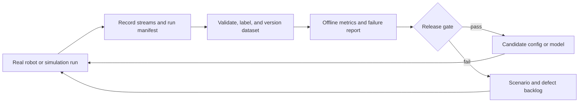

# M20 Navigation Data Flywheel

## Purpose

This document defines the first two stages of a data flywheel for M20 DAN navigation:

1. Produce reproducible navigation-run datasets from real robots and simulation.
2. Evaluate every dataset offline with stable metrics and release gates.

The immediate objective is not online learning or autonomous model deployment. It is to make every navigation change comparable, explainable, and reversible before learned components are introduced.

## Scope And Non-Goals

This work applies to the `m20-dan-nav` blueprint and its simulation counterpart.

In scope:

- Recording navigation inputs, decisions, outputs, and outcomes.
- Attaching run metadata, scenario identity, and software/configuration versions.
- Producing offline reports with acceptance metrics and failure categories.
- Using the same contract for simulation and real-robot runs.

Out of scope for the first two stages:

- Training or deploying a learned control policy.
- Allowing a robot to update its own controller while operating.
- Selecting an optimizer such as AdamW or Muon.

## Flywheel



Training is deliberately absent from the first loop. Once the recorded data and evaluator are trusted, they become the input and safety gate for behavior cloning, reinforcement learning, or model fine-tuning.

## Stage 1: Reproducible Navigation Records

`nav-record` is the stream-recording entry point. A useful dataset requires more than a database file: each run must also identify the exact scenario, code, configuration, and outcome.

### Required Run Manifest

Write one immutable manifest next to every recording. It must be created before motion begins and finalized after the run stops.

| Field | Requirement |
| --- | --- |
| `run_id` | Globally unique identifier shared by the database, report, and artifacts. |
| `source` | `simulation` or `real_robot`. |
| `scenario_id` | Stable name for map, route, obstacle layout, and test objective. |
| `started_at`, `ended_at` | Wall-clock timestamps plus recording time range. |
| `git_commit` | Exact DimOS commit. |
| `blueprint` | Normally `m20-dan-nav`; include the simulation blueprint when applicable. |
| `resolved_config` | Snapshot of all effective options, not only user overrides. |
| `robot` | Platform identifier and firmware or bridge version when available. |
| `map_id` | Map artifact version and coordinate frame. |
| `goal` | Goal pose, tolerance, and goal source. |
| `outcome` | Final result from the event taxonomy below. |

Never overwrite a manifest after evaluation. A correction creates a new manifest revision with a reason.

### Stream Contract

The initial dataset must record the following connected streams when available. Missing optional sensors are represented in the manifest, not silently omitted.

| Group | Streams |
| --- | --- |
| Robot state | `corrected_odometry`, `odometry` |
| Environment | `registered_scan`, `terrain_map`, `global_map` |
| Intent | `goal`, `way_point`, `goal_path` |
| Planning | `path`, `effective_cmd_vel`, `slow_down` |
| Control | `cmd_vel`, `stop_movement`, `goal_reached` |

The existing `NavRecord` module records these navigation streams. The remaining implementation work is the manifest writer and explicit event capture; do not infer the final outcome only from an absent stream.

### Event Taxonomy

Each run ends with exactly one primary outcome and may contain zero or more secondary events.

Primary outcomes:

- `goal_reached`
- `goal_timeout`
- `goal_cancelled`
- `planner_failed`
- `controller_failed`
- `safety_stop`
- `operator_takeover`
- `system_fault`

Secondary events include replanning, localization loss, map update, obstacle stop, watchdog restart, and transport loss. Each event needs a recording timestamp and a machine-readable reason code.

### Dataset Layout

Use a run directory instead of a collection of unnamed database files:

```text
<dataset_root>/<scenario_id>/<run_id>/
  manifest.json
  navigation.db
  events.jsonl
  artifacts/
    map-reference.*
    rerun.rrd
  report.json
  report.md
```

Large recordings and point clouds belong in the configured dataset store, not normal Git history. The manifest and report remain lightweight review artifacts.

### Stage 1 Acceptance Criteria

- A simulation run and a real-robot run both produce the same directory structure.
- A reviewer can reproduce the resolved configuration from `manifest.json`.
- Every run has one primary outcome and a reason when it does not reach the goal.
- A missing expected stream is reported as data quality failure.

## Stage 2: Offline Evaluation

The evaluator consumes only a run directory. It must not require a live robot, a live transport, or access to mutable configuration files.

### Core Metrics

| Metric | Definition | Direction |
| --- | --- | --- |
| Completion rate | Fraction of eligible goals with `goal_reached`. | Higher |
| Time to goal | Start-to-outcome duration for successful runs. | Lower |
| Path length | Integrated odometry distance until outcome. | Lower when success and safety are preserved |
| Goal position error | Final position distance from goal. | Lower |
| Goal yaw error | Final heading error when yaw is required. | Lower |
| Command smoothness | Linear and angular command rate or jerk summary. | Lower |
| Stop and replan count | Number of control stops and planner replans. | Lower unless required for safety |
| Minimum clearance | Minimum observed obstacle clearance where available. | Higher than the configured safety limit |
| Data completeness | Required manifest fields and expected streams present. | Complete |

Metrics must be reported with both aggregate values and per-run values. Aggregates without scenario-level evidence hide regressions.

### Scenario Sets

Maintain versioned scenario sets instead of one generic simulation run:

- Clear corridor and open-space goals.
- Tight turns and final orientation alignment.
- Static obstacle detours.
- Dynamic or moving-obstacle encounters.
- Goal cancellation and teleoperation takeover.
- Localization or transport degradation.
- Real-robot replay cases that previously failed.

Every defect that reaches a real robot should become a replayable scenario before its fix is accepted.

### Release Gates

A candidate navigation configuration or model can progress only when all of the following are true:

1. Required streams and manifest fields are complete.
2. No safety-stop, collision-risk, or system-fault regression occurs in the protected scenario set.
3. Completion rate does not regress beyond the agreed tolerance.
4. Clearance, final error, and command smoothness stay within configured limits.
5. Any improvement is measured against the same scenario-set version and baseline commit.

The evaluator should emit `pass`, `fail`, or `insufficient_data`. It must never convert incomplete data into a pass.

## Delivery Plan

| Milestone | Deliverable |
| --- | --- |
| M1 | Run manifest schema, outcome taxonomy, and dataset directory creator. |
| M2 | `nav-record` integration that creates the manifest and event log alongside the database. |
| M3 | Offline evaluator producing `report.json` and `report.md` for one run. |
| M4 | Versioned simulation scenario suite and baseline report. |
| M5 | Real-robot shadow recording and comparison against simulation. |

Do not begin learned-policy training before M3 is reliable and M4 has a stable baseline. AdamW remains an appropriate default once a training stage exists; newer optimizers are an experiment after data quality and evaluation are solved.

## Safety And Rollback

All collection and evaluation changes are offline-first. A candidate is validated in simulation, then shadow-recorded on hardware, then deployed gradually. Keep the prior blueprint/configuration version and baseline report available for immediate rollback.
