# M20 Long-Path Smoothing Performance Optimization And Validation Plan

## 1. Document Status

| Item | Value |
|---|---|
| Project | DimOS M20 true-simple-nav simulation chain |
| Repository | `/home/markus/work/dimos_m20` on VM `autoware-180` |
| Branch | `wd/m20-mujoco-simulation` |
| Planning baseline | `05ee0a8f` |
| Scope | Path smoothing, candidate generation, validation, and publication latency |
| Current priority | P0 |
| Planner behavior change allowed | No |
| Safety-rule change allowed | No |

This plan converts the completed bottleneck profile into an executable sequence
of small implementation and validation stages. The objective is to reduce
long-path latency without changing path geometry, selected alpha, collision
sampling, unknown-space semantics, clearance semantics, or controller input.

## 中文执行摘要

这份计划把优化拆成四个独立阶段：

1. 先补齐分阶段计时并冻结基线，不改变任何计算逻辑。
2. 候选轨迹全程保留为 NumPy 数组，只为最终选中的轨迹构造一次
   `Path/PoseStamped`，同时删除正常链路中重复且未使用的 raw resample。
3. 在内部热点中直接计算栅格下标，消除数万次
   `world_to_grid -> Vector3` 临时对象，同时严格保持 floor、越界、unknown
   和 lethal 语义。
4. 只有前两项仍不能达标时，才继续合并物理指标扫描或考虑原生数值循环。

每个阶段都必须先通过轨迹坐标、朝向、alpha、碰撞、unknown、净空和失败原因
的等价测试，再进入 2/5/10/20/40 m 性能矩阵。离线通过后，先进行机器人固定
的 100 目标 MuJoCo 测试，最后才允许机器人移动。主性能口径始终开启两个
shadow，禁止通过降低碰撞采样、减少迭代次数或放宽安全阈值来获得提速。

实施采用独立 commit 和普通 `git revert` 回滚；每个阶段完成后推送到
`origin` 和 `melolong` 并核对三方 hash。

## 2. Current Problem And Baseline

The current constrained smoothing pipeline scales almost linearly with raw path
point count. The representative offline baseline, with generic and physical
shadow enabled, is:

| Path length | Raw points | Current P50 |
|---|---:|---:|
| 2 m | 38 | 41.4 ms |
| 5 m | 93 | 85.7 ms |
| 10 m | 186 | 162.2 ms |
| 20 m | 372 | 311.4 ms |
| 40 m | 743 | 608.2 ms |

The latest 38-goal MuJoCo run measured 217.4 ms median and 434.4 ms P95 from
goal receipt to validator completion. A* itself took about 52.4 ms median;
post-A* smoothing, resampling, and validation took 165.3 ms median and is the
current bottleneck.

For a representative 20 m path, the 311 ms offline runtime is approximately:

| Work | Approximate time | Share |
|---|---:|---:|
| Repeated `Path/PoseStamped` construction and resampling | 140 ms | 45% |
| Iterative smoothing and local swept-cost checks | 140 ms | 45% |
| Distance transform, physical metrics, policy, report data | 20-30 ms | 10% |

The physical alpha comparison itself takes about 0.008 ms and is not a target.

## 3. Required Outcome

The optimized implementation must:

1. Preserve the exact legacy controller path within floating-point tolerance.
2. Preserve legacy and physical alpha decisions.
3. Preserve lethal, out-of-bounds, unknown, clearance, and mean-cost results.
4. Keep both shadow modes available and efficient.
5. Reduce shadow-enabled 10 m-and-longer P50 by at least 60% in the offline
   matrix.
6. Reduce post-A* P95 by at least 50% in the controlled MuJoCo matrix.
7. Add no new runtime dependency.
8. Keep the worktree, commits, reports, and remotes reproducible.

Initial offline performance gates are:

| Path length | P50 gate | P95 gate |
|---|---:|---:|
| 2 m | <= 20 ms | <= 24 ms |
| 5 m | <= 35 ms | <= 42 ms |
| 10 m | <= 60 ms | <= 72 ms |
| 20 m | <= 100 ms | <= 120 ms |
| 40 m | <= 180 ms | <= 216 ms |

These gates apply with both
`path_smoothing_validator_shadow_enabled=true` and
`path_smoothing_physical_validator_shadow_enabled=true`.

## 4. Non-Goals

This performance phase must not:

- lower collision sample density;
- reduce `path_smoothing_iterations` merely to pass a latency target;
- increase `path_smoothing_max_cost_increase`;
- relax unknown-length or clearance thresholds;
- process only a local path prefix;
- change A* weights or add turn-aware A*;
- enable authoritative physical selection;
- redesign LocalPlanner or the speed controller;
- add Numba, Cython, or another runtime dependency in the first implementation.

Those options alter behavior, architecture, or deployment requirements. The
measured allocation and indexing waste must be removed first.

## 5. Target Data Flow

```mermaid
flowchart LR
    A["Raw A* Path message"] --> B["Convert once to XY array"]
    B --> C["Validate raw array"]
    C --> D["Iterative smoothing on arrays"]
    D --> E["Generate raw and alpha arrays"]
    E --> F["Evaluate cost and physical metrics on arrays"]
    F --> G["Select legacy and physical alpha"]
    G --> H["Construct one final Path message"]
    H --> I["Publish to LocalPlanner"]
```



Candidate paths that are rejected or used only for shadow diagnostics must
never be converted to `Path/PoseStamped` messages.

## 6. Phase 0: Freeze Baseline And Add Timers

### 6.1 Code Changes

Add structured timing around the existing implementation before changing its
behavior. The timing record must contain:

```text
raw_path_points
raw_path_length_m
costmap_width
costmap_height
raw_validation_ms
reference_costs_ms
smoothing_loop_ms
smoothing_iterations
distance_transform_ms
raw_resample_metrics_ms
candidate_1_0_ms
candidate_0_5_ms
candidate_0_25_ms
candidate_0_125_ms
physical_policy_ms
final_path_message_ms
optimizer_total_ms
path_publish_ms
local_planner_handoff_ms
```

Primary files:

- `dimos/mapping/occupancy/path_resampling.py`
- `dimos/navigation/replanning_a_star/global_planner.py`

Emit one compact structured record per successful or rejected plan. Do not log
per-point or per-iteration records.

### 6.2 Baseline Artifacts

Create a benchmark runner:

```text
scripts/m20_path_smoothing_benchmark.py
```

It must support:

- fixed path lengths: 2, 5, 10, 20, and 40 m;
- fixed raw-point density and deterministic geometry;
- fixed costmap seed and dimensions;
- shadow on/off modes;
- configurable warm-up and measured repetitions;
- JSON and CSV output;
- process CPU time, wall time, and peak RSS;
- P50, P95, maximum, and per-phase distributions.

Default protocol:

```text
warm-up repetitions: 5 per case
measured repetitions: 30 per case
primary mode: both shadows enabled
secondary mode: both shadows disabled
costmap resolution: 0.05 m
path resample spacing: 0.1 m
collision sample spacing: 0.05 m
```

Store committed summaries under:

```text
docs/development/validation/path-smoothing-performance/YYYY-MM-DD/
```

Do not commit large terminal logs or redundant per-run binary files.

### 6.3 Phase Gate

Phase 0 passes when:

- all timing fields appear exactly once per plan;
- timing does not alter selected paths or alpha decisions;
- timing overhead is less than 3% P95;
- the baseline matrix can be reproduced twice within 10% P95 variation;
- the generated JSON and CSV validate successfully.

### 6.4 Phase 0 Result (2026-07-17)

**Status: passed.** Commit scope: structured timing, deterministic benchmark,
and non-LFS timing coverage only. Planner geometry and safety decisions were
not changed.

The committed benchmark fixture uses a fixed `220 x 1000` grid at `0.05 m`, a
fixed seed (`20260717`), the production spacing values, and both shadows. It is
deliberately independent of private LFS data. The baseline is higher than the
earlier exploratory profile because this frozen fixture has a larger fixed
costmap and deterministic mixed costs; all later speedup percentages use this
same fixture.

| Length | Raw points | Run A P50/P95 | Run B P50/P95 | P95 variation |
|---:|---:|---:|---:|---:|
| 2 m | 38 | 46.9 / 47.6 ms | 47.1 / 50.0 ms | 4.92% |
| 5 m | 93 | 109.2 / 112.9 ms | 110.0 / 112.9 ms | 0.04% |
| 10 m | 186 | 234.1 / 245.0 ms | 235.2 / 238.6 ms | 2.67% |
| 20 m | 372 | 480.9 / 494.3 ms | 477.3 / 489.6 ms | 0.97% |
| 40 m | 743 | 957.8 / 972.7 ms | 948.9 / 999.2 ms | 2.72% |

The four sequential runs showed VM frequency drift at 40 m, so timing overhead
was also measured in one process by alternating the uninstrumented baseline
and instrumented implementation on every repetition. This removes test-order
bias and produced the following P95 overhead:

| Length | Timing overhead |
|---:|---:|
| 2 m | -1.66% |
| 5 m | +1.18% |
| 10 m | -0.06% |
| 20 m | +0.95% |
| 40 m | +0.34% |

All values are below the 3% gate. Negative values are normal scheduling noise,
not a claimed speedup. At 20 m, Run A P50 decomposed into 304.4 ms smoothing,
35.5 ms raw resample/metrics, four 30.4-30.7 ms candidate evaluations, 5.4 ms
reference costs, 4.9 ms distance transform, and 1.9 ms raw validation. Physical
policy selection remained 0.01 ms.

Verification:

- all 19 required fields are emitted in one `Path smoothing performance`
  record per constrained plan, including path publish and LocalPlanner handoff;
- the new deterministic timing test passed;
- 24 non-LFS smoothing tests passed;
- two historical image tests could not run because the private
  `occupancy_simple.npy` LFS object requires unavailable credentials;
- JSON and CSV from both formal runs parsed successfully;
- the next permitted step is Phase 1 array-only candidate geometry.

Artifacts:

- `docs/development/validation/path-smoothing-performance/2026-07-17/phase0-instrumented-a.*`
- `docs/development/validation/path-smoothing-performance/2026-07-17/phase0-instrumented-b.*`
- `docs/development/validation/path-smoothing-performance/2026-07-17/phase0-baseline-a.*`
- `docs/development/validation/path-smoothing-performance/2026-07-17/phase0-baseline-b.*`
- `docs/development/validation/path-smoothing-performance/2026-07-17/phase0-interleaved-overhead.json`

## 7. Phase 1: Keep Candidate Geometry As Arrays

### 7.1 Implementation

Add one private NumPy arc-length resampler, for example:

```python
def _resample_xy_array(points: np.ndarray, spacing_m: float) -> np.ndarray:
    ...
```

Required semantics:

- preserve the first point;
- preserve the exact final point;
- remove or skip zero-length segments exactly as the current path does;
- place intermediate points at the same accumulated arc-length spacing;
- return an `(N, 2)` float64 array;
- do not create message objects.

Refactor candidate selection so it stores:

```text
raw_resampled_points
candidate_points_by_alpha
candidate_metrics_by_alpha
```

Only after the final legacy or authoritative alpha is selected may the code
construct one output `Path` and add orientations.

### 7.2 Remove Duplicate Work

The eager `simple_resample_path()` currently executed at the start of
`constrained_smooth_resample_path()` is unused on the normal valid smoothing
path and then recomputed inside candidate selection.

Change it to lazy fallback behavior:

- construct raw-resampled output only for smoothing-not-applicable paths;
- construct it for duplicate-point or invalid-raw fallback;
- otherwise keep the raw-resampled geometry as an array inside selection.

### 7.3 Compatibility Boundary

Keep public `simple_resample_path()` unchanged because other modules and tests
may depend on its message-based API. The optimized array helper remains private
to constrained smoothing.

### 7.4 Phase Gate

Phase 1 passes when:

- every equivalence test in Section 10 passes;
- only one final candidate becomes a `Path` message;
- a 20 m shadow-enabled path improves by at least 35%;
- no candidate, metric, report, or selected-alpha field disappears;
- no new fallback or invalid-baseline case appears.

### 7.5 Phase 1 Result (2026-07-17)

**Status: functional gate passed; standalone performance gate not passed.**
The implementation keeps raw and alpha candidates as float64 XY arrays,
removes the eager normal-path resample, and constructs exactly one final
message. Public `simple_resample_path()` remains unchanged.

The first vectorized interpolation prototype differed by only
`10^-15-10^-14 m`, but a real snapshot had samples exactly on grid boundaries;
the tiny difference changed P5 clearance cells. It was rejected. The accepted
array resampler preserves the legacy arithmetic order without creating
messages and achieved exact (`0.0`) XY and quaternion equality on all retained
comparison cases.

| Length | Phase 0 P50/P95 | Phase 1 P50/P95 | P50 reduction |
|---:|---:|---:|---:|
| 2 m | 47.0 / 48.8 ms | 33.0 / 35.2 ms | 29.7% |
| 5 m | 109.6 / 112.9 ms | 75.1 / 78.2 ms | 31.4% |
| 10 m | 234.7 / 241.8 ms | 172.3 / 180.8 ms | 26.6% |
| 20 m | 479.1 / 492.0 ms | 358.7 / 376.6 ms | 25.1% |
| 40 m | 953.4 / 985.9 ms | 691.6 / 715.5 ms | 27.5% |

At 20 m, each candidate evaluation fell from about `30.5 ms` to
`3.2 ms`, while the remaining smoothing loop was `315.9 ms` P50. Therefore the
array/message objective succeeded, but the total 20 m improvement did not meet
the standalone 35% gate. The residual is the object-heavy grid conversion that
Phase 2 explicitly targets, not candidate allocation. Phase 2 is authorized as
the required continuation; the combined gate is not waived.

Equivalence evidence:

- 5 deterministic lengths and both retained real snapshots had exact point
  count, XY, quaternion, legacy alpha, physical alpha, and candidate-report
  equality against Phase 0;
- straight, vertical, diagonal, repeated, exact-spacing, longer-than-path,
  negative-coordinate, and seeded random polyline resampling tests passed;
- normal shadow execution constructs one final Path message;
- no candidate field, rejection reason, fallback, or invalid baseline changed.

Artifacts:

- `docs/development/validation/path-smoothing-performance/2026-07-17/phase1-array-candidates.json`
- `docs/development/validation/path-smoothing-performance/2026-07-17/phase1-array-candidates.csv`
- `docs/development/validation/path-smoothing-performance/2026-07-17/phase1-equivalence.json`

## 8. Phase 2: Replace Object-Heavy Grid Conversion

### 8.1 Implementation

Add a small internal helper or inline calculation that converts world XY to
grid integer coordinates without constructing `Vector3`:

```python
grid_x = math.floor((x - origin_x) / resolution)
grid_y = math.floor((y - origin_y) / resolution)
```

Use it in the path-cost and physical-metric hot paths.

The implementation must preserve:

- `math.floor`, including negative coordinates;
- width and height bounds checks;
- out-of-bounds failure before grid access;
- `value >= CostValues.OCCUPIED` as lethal;
- `CostValues.UNKNOWN` effective cost of 80;
- current first-sample and shared-endpoint rules;
- current represented-length calculation for unknown exposure.

Do not change the public `OccupancyGrid.world_to_grid()` API globally in this
phase. Optimize only the measured internal hot path.

### 8.2 Phase Gate

Phase 2 passes when:

- deterministic and randomized cost-validation equivalence tests pass;
- every failure reason and mean cost matches the baseline;
- the 370-local-triple benchmark is at least 5x faster;
- all offline length P50/P95 gates in Section 3 pass;
- output geometry and alpha decisions remain equivalent.

### 8.3 Phase 2 Result (2026-07-17)

**Status: implementation and relative-improvement gates passed; absolute
offline matrix requires Phase 3.** Direct indexing is limited to the measured
internal hot paths; public `OccupancyGrid.world_to_grid()` is unchanged.

The first helper-only implementation improved the 370-local-triple benchmark
by just `1.35x` because it still allocated a NumPy point per sample and a list
for `np.mean`. The accepted implementation retains scalar XY values, caches
grid metadata, accumulates effective cost directly, and preserves all original
sample-count, shared-endpoint, floor, bounds, unknown, and lethal rules.

Microbenchmark (`370` triples, `50` alternating repetitions):

| Metric | Legacy | Direct | Speedup |
|---|---:|---:|---:|
| P50 | 5.151 ms | 0.771 ms | 6.68x |
| P95 | 5.729 ms | 0.821 ms | 6.97x |

Shadow-enabled formal matrix:

| Length | P50 | P95 | P50 reduction vs Phase 0 | Absolute gate |
|---:|---:|---:|---:|---|
| 2 m | 17.9 ms | 19.8 ms | 61.9% | pass |
| 5 m | 35.2 ms | 37.6 ms | 67.9% | fail P50 by 0.2 ms |
| 10 m | 73.3 ms | 78.7 ms | 68.7% | fail |
| 20 m | 144.5 ms | 148.4 ms | 69.8% | fail |
| 40 m | 285.6 ms | 297.9 ms | 70.0% | fail |

The relative `>=60%` objective is met for every length and all behavior checks
pass, but the frozen fixture uses more smoothing iterations than the earlier
exploratory profile on which the absolute gates were based. The gates are not
changed or waived. At 20 m, `117.4 ms` of `144.5 ms` remains in the sequential
smoothing loop, so optional Phase 3 is required before final offline
acceptance.

Equivalence evidence:

- seeded grids and paths across positive and negative map origins match legacy
  mean cost within `1e-12` and have identical failure reasons;
- nextafter samples immediately around cell boundaries match public conversion;
- all 5 deterministic lengths and 2 retained real snapshots preserve exact
  path geometry, quaternions, physical metrics, candidate reports, and alpha;
- no public API or safety/configuration threshold changed.

Artifacts:

- `docs/development/validation/path-smoothing-performance/2026-07-17/phase2-direct-grid.json`
- `docs/development/validation/path-smoothing-performance/2026-07-17/phase2-direct-grid.csv`
- `docs/development/validation/path-smoothing-performance/2026-07-17/phase2-equivalence.json`
- `docs/development/validation/path-smoothing-performance/2026-07-17/phase2-grid-microbenchmark.json`

## 9. Phase 3: Optional Residual Optimization

Run this phase only if Phase 2 does not meet the full target.

### 9.1 Vectorize Physical Metrics

Generate sampled XY arrays and integer grid indices once per path, then derive:

- lethal and out-of-bounds status;
- mean effective cost;
- unknown represented length;
- minimum clearance;
- P5 clearance.

Avoid three separate scans of the same samples. Reuse the one distance
transform already computed per plan.

### 9.2 Native Smoothing Boundary

If iterative smoothing remains above the accepted budget after array and grid
optimizations, move only the sequential numeric loop to the project's existing
native-extension approach. Keep message conversion, reporting, and policy in
Python.

Do not introduce a native implementation until Python behavior is fully
captured by equivalence tests.

### 9.3 Phase 3 Result (2026-07-17)

**Status: passed; native extension not required.** The sequential Gauss-Seidel
smoothing order and iteration limit remain unchanged. The Python loop now uses
the same scalar operation order and a dedicated allocation-free local-triple
cost check instead of creating candidate arrays and `np.vstack` objects for
every interior point.

Shadow-enabled formal matrix:

| Length | P50 | P95 | P50 reduction vs Phase 0 | Gate |
|---:|---:|---:|---:|---|
| 2 m | 10.9 ms | 13.0 ms | 76.7% | pass |
| 5 m | 19.5 ms | 21.3 ms | 82.2% | pass |
| 10 m | 35.4 ms | 36.4 ms | 84.9% | pass |
| 20 m | 66.8 ms | 68.4 ms | 86.1% | pass |
| 40 m | 128.8 ms | 132.8 ms | 86.5% | pass |

At 20 m, the smoothing-loop P50 fell from `117.4 ms` in Phase 2 to
`40.5 ms`; optimizer P50 is `66.8 ms`, below the `100 ms` gate. All five P50
and P95 gates now pass with both shadows enabled. Shadow-off P50 is
`4.7/11.7/26.1/54.2/111.7 ms` for 2/5/10/20/40 m.

The dedicated local-triple function matches general validation within
`1e-12` over 250 seeded cases. Five deterministic lengths and both retained
real snapshots still have exact (`0.0`) XY, quaternion, candidate report, and
alpha equality against Phase 0. No native dependency or safety-rule change was
introduced.

Artifacts:

- `docs/development/validation/path-smoothing-performance/2026-07-17/phase3-smoothing-loop.json`
- `docs/development/validation/path-smoothing-performance/2026-07-17/phase3-smoothing-loop.csv`
- `docs/development/validation/path-smoothing-performance/2026-07-17/phase3-equivalence.json`

## 10. Functional Equivalence Test Plan

### 10.1 Arc-Length Resampling Tests

Compare current and new resampling for:

- straight horizontal and vertical paths;
- diagonal paths;
- repeated points;
- zero-length interior segments;
- one-, two-, and many-point paths;
- spacing longer than total path length;
- exact-multiple and non-exact-multiple lengths;
- negative world coordinates;
- random deterministic polylines.

Acceptance:

```text
same output point count
maximum XY error <= 1e-10 m
same first and final XY
orientation quaternion error <= 1e-10
```

### 10.2 Cost And Collision Tests

Cover:

- free cells;
- positive gradient costs;
- unknown cells;
- lethal cells;
- positive and negative map origins;
- points immediately inside and outside every boundary;
- samples exactly on cell boundaries;
- segments shorter, equal to, and longer than sample spacing;
- shared segment endpoints;
- random seeded grids and paths.

Acceptance:

```text
same mean cost within 1e-12
same validation_reason
same sampled-cell sequence where inspected
same unknown represented length within 1e-10 m
```

### 10.3 Candidate-Selection Tests

Verify scenarios selecting:

- alpha 1.0;
- alpha 0.5;
- alpha 0.25;
- alpha 0.125;
- raw fallback;
- lethal rejection;
- out-of-bounds rejection;
- unknown-length rejection;
- clearance-loss rejection;
- legacy and physical disagreement while authoritative remains false.

Acceptance:

```text
same legacy_selected_alpha
same physical_selected_alpha
same physical_decision_matches_legacy
same rejection reason for every alpha
same final controller path
```

### 10.4 Real And Generated Snapshot Tests

Required cases:

- retained real planning snapshot;
- retained real detour snapshot;
- 0.95 m invalid corridor;
- 1.00 m invalid corridor;
- 1.20 m valid corridor;
- straight, turn, S, and V paths;
- historical unknown-increase and clearance-loss cases.

Temporary `/tmp` snapshots are not sufficient for CI. Promote only the minimal,
non-sensitive deterministic fixture required for regression, or generate the
fixture in the test itself.

## 11. Offline Performance Validation

Run on the same VM with:

- no active MuJoCo process;
- no stale diagnostic CPU process;
- the same Python environment and commit;
- the same costmap and path seeds;
- both shadows enabled for the primary result;
- at least 30 measured repetitions per length.

Report:

- raw point count and path length;
- optimizer P50/P95/max;
- each phase P50/P95/max;
- process CPU time;
- peak RSS;
- output-equivalence status;
- legacy and physical alpha counts;
- invalid and fallback counts.

The optimized and baseline runs must be interleaved or repeated in both orders
to reduce CPU-frequency and VM scheduling bias.

## 12. MuJoCo Integration Validation

### 12.1 Fixed-Robot Matrix

Start `m20-true-simple-nav-sim` with the robot held fixed. Use identical scene,
map warm-up, goals, and hold-position behavior for baseline and optimized runs.

Run at least:

```text
100 successful plans
20 goals below 3 m
20 goals from 3 to 6 m
20 goals from 6 to 10 m
20 goals above 10 m where the map permits
20 obstacle/unknown/narrow-passage goals
```

Capture timestamps for:

```text
click publish
goal callback receive
raw A* publish
optimizer start and finish
smooth path publish
Rerun bridge receive
LocalPlanner handoff
```

Fixed-robot gate:

- zero path or alpha differences outside tolerance;
- zero new planner exceptions;
- zero shadow-record mismatches;
- zero selected-policy violations;
- post-A* P95 reduced by at least 50%;
- end-to-end P95 reduced by at least 35%;
- CPU and RSS do not regress by more than 10%.

### 12.2 Moving-Robot Functional Run

Only after the fixed-robot gate passes:

- run open, obstacle-constrained, narrow, and moving-obstacle routes;
- verify path completion, replans, stuck logic, and goal cancellation;
- confirm no collision or command discontinuity caused by path publication;
- inspect raw and smooth path overlays in Rerun;
- verify web and desktop viewer behavior separately.

This phase validates integration, not just numeric equivalence.

## 13. Focused Verification Commands

The implementation task should run at least:

```bash
cd /home/markus/work/dimos_m20
source .venv/bin/activate

pytest -q dimos/mapping/occupancy/test_path_resampling.py
pytest -q dimos/mapping/occupancy/test_constrained_path_smoothing.py
pytest -q dimos/navigation/replanning_a_star/test_global_planner_stuck.py
pytest -q dimos/robot/deeprobotics/m20/nav/test_m20_true_simple_nav_sim.py

ruff check \
  dimos/mapping/occupancy/path_resampling.py \
  scripts/m20_path_smoothing_benchmark.py

ruff format --check \
  dimos/mapping/occupancy/path_resampling.py \
  scripts/m20_path_smoothing_benchmark.py

git diff --check
```

If a historical test requires unavailable private LFS data, record it as a
known environment limitation and run the new deterministic non-LFS equivalent.
Do not report an unavailable LFS test as a passed test.

## 14. Commit And Push Strategy

Use small, independently revertible commits:

```text
perf(nav): add smoothing phase diagnostics
perf(nav): keep smoothing candidates as arrays
perf(nav): remove object-heavy grid conversion
test(nav): add long-path smoothing performance matrix
docs(nav): record smoothing optimization validation
```

After each implementation commit:

1. run focused functional tests;
2. run the relevant performance subset;
3. inspect the diff for accidental parameter changes;
4. push `wd/m20-mujoco-simulation` to `origin` and `melolong`;
5. verify local, origin, and melolong hashes match.

Do not force-push or combine unrelated control/planning work into these commits.

## 15. Rollback And Stop Conditions

Use normal `git revert` of the smallest failing commit. Do not use destructive
reset commands.

Stop the optimization and investigate before continuing if:

- any selected alpha changes unexpectedly;
- path point count or endpoint changes;
- a new lethal, unknown, clearance, or out-of-bounds difference appears;
- raw-baseline-invalid behavior changes without an explicit safety task;
- P95 improves only when shadow is disabled;
- CPU or RSS increases by more than 10%;
- live performance differs from offline performance by more than 2x without an
  identified simulator or scheduling cause.

## 16. Final Deliverables

The optimization is complete only when the repository contains:

- phase timing in structured planner logs;
- the behavior-preserving optimized implementation;
- deterministic equivalence tests;
- a reproducible offline benchmark runner;
- baseline and optimized JSON/CSV summaries;
- a MuJoCo fixed-robot and moving-robot validation report;
- updated upgrade-log conclusions;
- clean commits pushed to both remotes.

## 17. Execution Checklist

- [x] Phase 0 timing fields implemented and baseline frozen.
- [x] Benchmark runner and deterministic fixtures added.
- [x] Phase 1 array-only candidate pipeline implemented.
- [x] Duplicate eager resampling removed.
- [ ] Phase 1 equivalence and performance gate passed.
- [x] Phase 2 direct grid-index path implemented.
- [x] Randomized cost and boundary equivalence passed.
- [x] Offline 2/5/10/20/40 m P50/P95 gates passed.
- [x] Optional Phase 3 decision recorded.
- [ ] Fixed-robot MuJoCo 100-plan gate passed.
- [ ] Moving-robot integration gate passed.
- [ ] CPU/RSS and viewer latency reported.
- [ ] Upgrade log and validation artifacts updated.
- [ ] All commits pushed and remote hashes verified.
