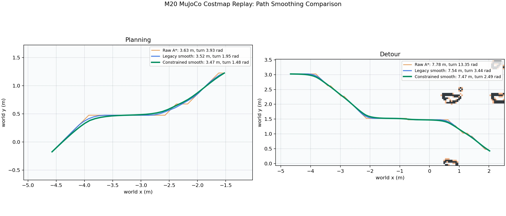
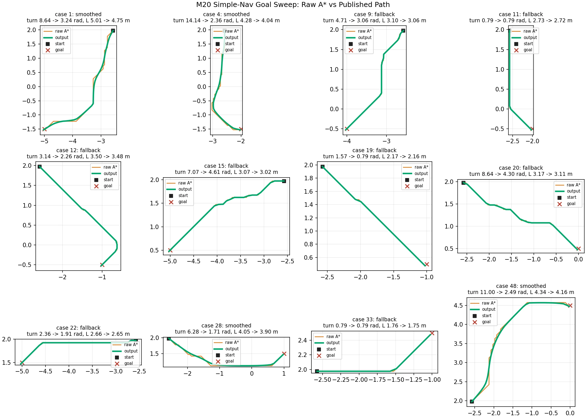
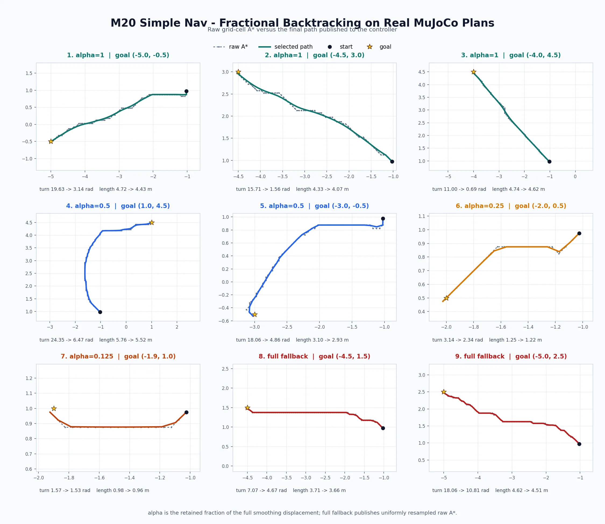
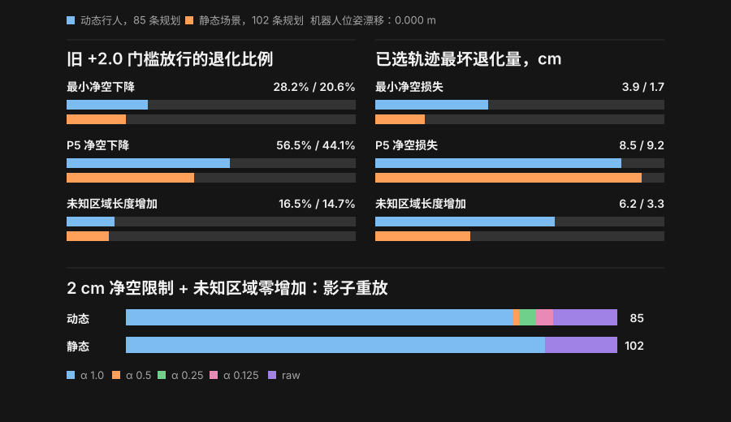
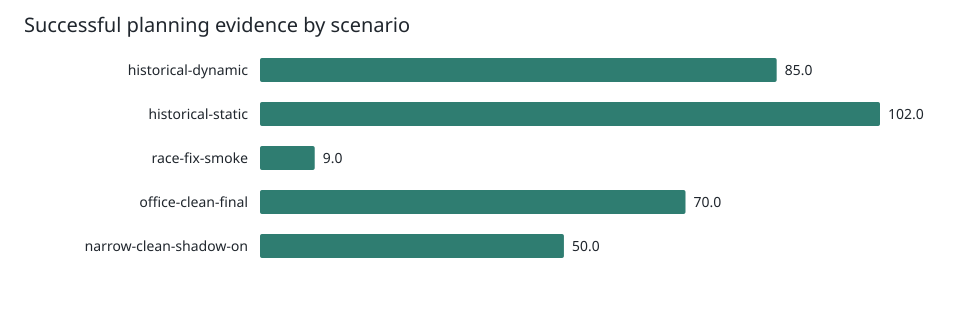

# M20 True Simple-Nav Upgrade Log

- Status: Active engineering record
- Baseline: `wd/m20-mujoco-simulation`, commit `5ecbb8e1`
- Scope: MuJoCo `m20-true-simple-nav-sim` planning path quality and stability
- Updated: 2026-07-16

## Purpose

This document records the observed simple-nav behavior, the candidate fixes,
and the changes actually implemented. It separates verified facts from design
options so later tuning and real-robot work can start from a known state.

## System Architecture

The simulation blueprint `m20_true_simple_nav_sim` is defined in
`dimos/robot/deeprobotics/m20/nav/m20_true_simple_nav.py`. It wires the
following modules together through `autoconnect`:

```text
┌─────────────────────────────────────────────────────────────────────────┐
│                         m20-true-simple-nav-sim                          │
├─────────────────────────────────────────────────────────────────────────┤
│  M20MujocoSimConnection                                                  │
│      │ publishes: dimos/slam_odom, dimos/slam_aligned_points            │
│      │ consumes: cmd_vel (from MovementManager)                         │
│      ▼                                                                   │
│  ┌─────────────────┐    ┌──────────────┐    ┌──────────────────────┐   │
│  │ RayTracing      │───▶│ CostMapper   │───▶│ ReplanningAStar      │   │
│  │ VoxelMap        │    │              │    │ Planner              │   │
│  └─────────────────┘    └──────────────┘    └──────────┬───────────┘   │
│                                                        │                │
│                                                        ▼                │
│                                              ┌──────────────────┐      │
│                                              │ MovementManager  │      │
│                                              │   (mux + relay)  │      │
│                                              └────────┬─────────┘      │
│                                                       │                 │
│                                                       ▼                 │
│                                              ┌──────────────────┐      │
│                                              │ M20MujocoSimConn │      │
│                                              │   (cmd_vel ► sim)│      │
│                                              └──────────────────┘      │
│                                                                          │
│  Auxiliary: M20TF publishes transforms from dimos/slam_odom             │
└─────────────────────────────────────────────────────────────────────────┘
```

The blueprint is started with:

```bash
cd /home/markus/work/dimos_m20
source .venv/bin/activate
dimos --rerun-open none run m20-true-simple-nav-sim
```

The checked-in MuJoCo profile lives in
`dimos/robot/deeprobotics/m20/config/mujoco_sim.yaml`.

---

## Planning and Control Pipeline

This section decomposes the ReplanningAStarPlanner into its internal
components. The pipeline is a single geometric path planner followed by a
real-time tracking controller; there is no separate local trajectory
optimizer.

### 1. ReplanningAStarPlanner (Module wrapper)

`dimos/navigation/replanning_a_star/module.py`

| Input topic | Source | Purpose |
|-------------|--------|---------|
| `odometry` / `odom` | SLAM (`dimos/slam_odom`) | Robot pose for planning start and deviation checks |
| `global_costmap` | CostMapper | Occupancy grid for A* and clearance checks |
| `goal_request` / `target` / `clicked_point` | Rerun click or external goal | Target pose |
| `stop_movement` | MovementManager | Teleop override – cancel active goal |

| Output topic | Consumer | Purpose |
|--------------|----------|---------|
| `path` | LocalPlanner + Rerun | Resampled controller waypoints |
| `raw_path` | Rerun (diagnostic) | Un-smoothed A* grid path when `publish_raw_path=True` |
| `nav_cmd_vel` | MovementManager | Twist commands from LocalPlanner |
| `goal_reached` | Upper layers | Boolean arrival signal |
| `navigation_costmap` | Rerun (debug) | Gradient costmap when `DEBUG_NAVIGATION` is set |

All tunable parameters are injected through `ReplanningAStarPlannerConfig`
and forwarded to `GlobalPlanner`.

### 2. GlobalPlanner

`dimos/navigation/replanning_a_star/global_planner.py`

This is the decision engine. It runs on its own monitoring thread (10 Hz)
and owns:

- **Dual navigation maps**
  - `_navigation_map` (Voronoi) – used when goal distance > 1.5 m. Favours
    corridors with extra obstacle clearance.
  - `_navigation_map_near` (Gradient) – used when goal distance ≤ 1.5 m.
    More direct to the target.

- **Planning sequence** (`_plan_path()`)
  ```text
  1. _find_safe_goal(goal)
        └─► If goal cell is UNKNOWN or OCCUPIED, BFS for nearest safe cell
  2. _find_wide_path(safe_goal, robot_pos)
        └─► Choose map (Voronoi vs Gradient) → run min_cost_astar()
  3. Smooth / resample
        ├─► Constrained mode: constrained_smooth_resample_path()
        └─► Legacy mode:     smooth_resample_path()
  4. Publish path → start LocalPlanner
  ```

- **Replan triggers** (monitored every 100 ms)

  | Trigger | Condition | Result |
  |---------|-----------|--------|
  | Path deviation | Distance from odometry to published path > 0.9 m | Full remaining route replan |
  | Stuck (progress) | 8 s with < 0.2 m cumulative path progress, linear cmd > 0.1 m/s, and goal > 0.5 m away | Full remaining route replan |
  | Obstacle ahead | LocalPlanner detects lethal cell within next 3 m | Stop → replan |
  | Controller error | LocalPlanner thread raises exception | Stop → replan |
  | Arrival | Distance < 0.2 m and yaw error < 15° | Clear goal, signal arrived |

  **Important:** every recovery replan regenerates the **entire remaining
  global path** from the current odometry to the original goal. It is not a
  local segment repair.

- **Replan safeguard:** `ReplanLimiter` allows at most 6 retry attempts
  while the robot stays within 2 m of the first retry position. After the
  limit the goal is cancelled instead of retrying forever.

### 3. A* Pathfinder

`dimos/navigation/replanning_a_star/min_cost_astar.py`

- 8-connected grid with Octile distance heuristic.
- C++ extension (`min_cost_astar_ext`) is used when available; Python
  fallback preserves identical semantics.
- Edge objective (P1 upgrade):
  ```text
  objective = distance_weight * move_distance
            + cell_cost_weight * (cell_cost / cost_threshold)
  ```
  M20 MuJoCo defaults: `distance_weight=1.0`, `cell_cost_weight=3.0`.
- Unknown cells: cost = `cost_threshold * unknown_penalty` = `100 * 0.8 = 80`.
  Traversable but penalised.

### 4. LocalPlanner + PController

`dimos/navigation/replanning_a_star/local_planner.py`
`dimos/navigation/replanning_a_star/controllers.py`

LocalPlanner runs a 10 Hz control loop with the following state machine:

```text
┌─────────────┐    yaw aligned    ┌────────────────┐    near goal    ┌────────────────┐
│   idle      │──────────────────▶│ path_following │───────────────▶│ final_rotation │
└─────────────┘                   └────────────────┘                └────────────────┘
        │                                 │                                 │
        │   new path                      │   obstacle / error              │   yaw aligned
        ▼                                 ▼                                 ▼
   initial_rotation ─────────────────────┘                            arrived
```

Each cycle:
1. Update `PathClearance` costmap and current pose index.
2. **Obstacle check:** `PathClearance.is_obstacle_ahead()` scans the next
   3 m of the path footprint against the binary costmap. If any cell is
   `OCCUPIED (100)`, signal `obstacle_found` and stop.
3. Compute `cmd_vel` according to state:

   - **`initial_rotation`:** rotate in place until heading aligns with the
     first path segment (tolerance 0.35 rad ≈ 20°).
   - **`path_following`:**
     - Find closest path point (`PathDistancer`).
     - If distance to goal < 0.2 m → switch to `final_rotation`.
     - Else compute lookahead point and call `PController.advance()`.
   - **`final_rotation`:** rotate in place until yaw error < 0.35 rad.

#### PController behaviour

- **Rotate-then-drive** strategy:
  - If |yaw error| > 90° → pure rotation (`angular = k_angular * yaw_error`).
  - Else → drive forward with speed scaled by heading alignment:
    ```text
    linear  = speed * (1 - |yaw_error| / 90°)
    angular = k_angular * yaw_error
    ```
- Minimum velocity thresholds: `min_linear = 0.2 m/s`, `min_angular = 0.2 rad/s`
  (raised to `0.6 rad/s` for real M20).
- Simulation boost: if |angular| < 0.8 rad/s in sim, clamp to 0.8 to avoid
  stall.

### 5. MovementManager

`dimos/navigation/movement_manager/movement_manager.py`

- Muxes two velocity sources:
  - `nav_cmd_vel` – planner output (default).
  - `tele_cmd_vel` – keyboard / joystick teleop (priority override).
- Teleop activation starts a `tele_cooldown_sec = 1.0 s` window during
  which nav commands are ignored.
- Any teleop input also publishes `stop_movement=True`, which cancels the
  active planner goal.

### 6. PathClearance (forward obstacle detection)

`dimos/navigation/replanning_a_star/path_clearance.py`

- Builds a swept-area mask (`make_path_mask`) over the next 3 m of path,
  inflated by `robot_width`.
- Checks whether any cell inside the mask equals `CostValues.OCCUPIED (100)`.
- **Note:** unknown cells (`-1`) are **not** treated as obstacles here,
  even though A* may route through them at a penalty.


## From Global Path to Robot Command: The Single-Run Flow

This section walks through exactly what happens after `GlobalPlanner` publishes
one `path` message and before the robot receives `cmd_vel`. No replanning is
involved; the focus is the closed-loop tracking of a single geometric path.

### 1. Path Hand-Off

```text
GlobalPlanner._plan_path()
    │
    │  path = Path(poses=[...])     # resampled waypoints, 0.1 m spacing
    ▼
LocalPlanner.start_planning(path)
    │
    ├──► PathDistancer(path)        # precompute cumulative arc lengths
    ├──► PathClearance(path)        # prepare 3 m forward mask template
    ├──► pose_index = 0
    └──► spawn Thread(_loop)        # 10 Hz control loop starts
```

`PathDistancer` converts the `Path` message into a NumPy array of `(x, y)`
points and builds a `cumulative_dists` array via `_make_cumulative_distance_array`.
This makes every "distance along path" query O(log N) instead of O(N).

---

### 2. The 10 Hz Control Loop

```text
                    ┌─────────────────────────────────────┐
                    │         LocalPlanner._loop()        │
                    │            (runs at 10 Hz)          │
                    └─────────────────┬───────────────────┘
                                      │
        ┌─────────────────────────────┼─────────────────────────────┐
        │                             │                             │
        ▼                             ▼                             ▼
┌───────────────┐         ┌─────────────────────┐       ┌──────────────────┐
│ 1. Update     │         │ 2. Obstacle Check   │       │ 3. Compute State │
│    PathClear  │         │    (next 3 m)       │       │    Machine       │
│    ance mask  │         │                     │       │                  │
└───────────────┘         └─────────────────────┘       └──────────────────┘
        │                             │                             │
        │                             │                             │
        ▼                             ▼                             ▼
  binary_costmap               is_obstacle_ahead()?
  (latest from                 │
   NavigationMap)              ├── YES ──► stopped_navigating
                               │            .on_next("obstacle_found")
                               │            break loop
                               │
                               └── NO ───► continue to state machine
```

**Cycle timing:** `sleep_time = max(0, 0.1 s - elapsed_computation)`. If the
compute step takes longer than 100 ms the loop does not catch up; it simply
proceeds to the next iteration immediately.

---

### 3. State Machine Overview

```text
┌─────────┐   start_planning()   ┌─────────────────┐
│  idle   │─────────────────────▶│ initial_rotation│
└─────────┘                      └────────┬────────┘
                                          │
                    |yaw_error| < 0.35 rad│
                                          ▼
                               ┌─────────────────┐
                               │  path_following │◄────┐
                               └────────┬────────┘     │
                                        │              │
          distance_to_goal < 0.2 m      │              │ replan / new path
                                        ▼              │
                               ┌─────────────────┐     │
                               │ final_rotation  │     │
                               └────────┬────────┘     │
                                        │              │
                    |yaw_error| < 0.35 rad│              │
                                        ▼              │
                               ┌─────────────────┐     │
                               │    arrived      │─────┘
                               └─────────────────┘
```

| State | Entry condition | Exit condition |
|-------|-----------------|----------------|
| `initial_rotation` | New path received | Robot heading aligns with first path segment (±0.35 rad) |
| `path_following` | Initial rotation complete | Distance to goal < 0.2 m |
| `final_rotation` | Near goal position | Robot heading aligns with goal orientation (±0.35 rad) |
| `arrived` | Final rotation complete | Emits `"arrived"`, loop breaks |

---

### 4. Path-Following: Geometry to Velocity

This is the most active state. Each 100 ms cycle performs the following exact
sequence:

#### 4.1 Closest Point Lookup

```text
odom.position ──► current_pos = [x, y]
                     │
                     ▼
         PathDistancer.find_closest_point_index(current_pos)
                     │
                     ├──► distances = ||_path - current_pos||₂   # vectorised
                     ├──► closest_idx = argmin(distances)
                     └──► self._pose_index = closest_idx
```

#### 4.2 Goal Proximity Check

```text
PathDistancer.distance_to_goal(current_pos)
    │
    ├──► dist = ||path[-1] - current_pos||₂
    │
    ├──► dist < 0.2 m  ?  ──► switch to "final_rotation"
    │
    └──► dist ≥ 0.2 m  ?  ──► continue to lookahead
```

#### 4.3 Lookahead Point Selection

```text
PathDistancer.find_lookahead_point(closest_idx)
    │
    ├──► base_dist = cumulative_dists[closest_idx - 1]   (or 0 if idx==0)
    ├──► target_dist = base_dist + 0.5 m                  # _lookahead_dist
    │
    ├──► Binary search cumulative_dists for target_dist
    │
    ├──► If target beyond end of path:
    │        return path[-1]
    │
    └──► Else interpolate within segment [idx, idx+1]:
             t = (target_dist - prev_cum_dist) / segment_dist
             return path[idx] + t * (path[idx+1] - path[idx])
```

The result is a single `(x, y)` lookahead point **0.5 m ahead** of the robot's
closest projection on the path, linearly interpolated between waypoints.

#### 4.4 PController.advance()

```text
lookahead_point ──┐
current_odom  ────┼──► PController.advance()
                  │
                  ▼
    direction = lookahead_point - current_pos
    distance  = ||direction||₂
    robot_yaw = current_odom.orientation.euler[2]
    desired_yaw = atan2(direction[1], direction[0])
    yaw_error   = angle_diff(desired_yaw, robot_yaw)   # wrapped to [-π, π]

    angular_velocity = k_angular * yaw_error
    angular_velocity = clip(angular_velocity, -speed, +speed)
    angular_velocity = apply_min_velocity(angular_velocity, min_angular)

    ┌─────────────────────────────────────────────────────────────┐
    │  IF |yaw_error| > 90° (π/2)                                 │
    │     ──► Rotate in place:  linear = 0, angular = angular_v  │
    │                                                             │
    │  ELSE                                                       │
    │     ──► Drive + steer:                                     │
    │         linear  = speed * (1 - |yaw_error| / (π/2))        │
    │         linear  = apply_min_velocity(linear, min_linear)   │
    │         angular = angular_velocity                         │
    └─────────────────────────────────────────────────────────────┘

    Return Twist(linear=[linear, 0, 0], angular=[0, 0, angular])
```

**Current parameter values (M20 sim):**

| Parameter | Value | Meaning |
|-----------|-------|---------|
| `speed` | 0.55 m/s | Nominal forward speed |
| `k_angular` | 0.5 | Proportional gain on heading error |
| `min_linear` | 0.2 m/s | Floor for forward velocity |
| `min_angular` | 0.2 rad/s | Floor for rotation velocity (real M20: 0.6) |
| `rotation_threshold` | π/2 (90°) | Boundary between rotate-in-place and drive |
| `lookahead_dist` | 0.5 m | How far ahead on the path to track |

**Simulation boost:** if the computed |angular| < 0.8 rad/s and `global_config.simulation` is true, it is clamped to `0.8 * sign(angular)`. This prevents the Go1 MuJoCo model from stalling on very small angular corrections.

---

### 5. Rotation States

Both `initial_rotation` and `final_rotation` call `PController.rotate(yaw_error)`:

```text
yaw_error = angle_diff(target_yaw, robot_yaw)

angular = k_angular * yaw_error
angular = clip(angular, -speed, +speed)
angular = apply_min_velocity(angular, min_angular)

Return Twist(linear=[0, 0, 0], angular=[0, 0, angular])
```

- **Initial rotation** target: `path.poses[0].orientation.euler[2]` (first segment heading).
- **Final rotation** target: `path.poses[-1].orientation.euler[2]` (goal orientation).

When |yaw_error| drops below `orientation_tolerance = 0.35 rad` (~20°), the state
advances.

---

### 6. Forward Obstacle Detection (PathClearance)

Before the state machine runs every cycle, the loop calls:

```text
PathClearance.is_obstacle_ahead()
    │
    ├──► make_path_mask(
    │        occupancy_grid = binary_costmap,
    │        path           = current_path,
    │        robot_width    = global_config.robot_width,
    │        pose_index     = current_pose_index,
    │        max_length     = 3.0 m
    │    )
    │
    └──► np.any(costmap.grid[mask] == OCCUPIED)
              │
              ├── TRUE  ──► obstacle ahead
              └── FALSE ──► path is clear
```

The mask covers a **swept corridor** from the current pose index forward for
3 m, inflated laterally by `robot_width`. Only cells with value `100`
(`OCCUPIED`) trigger a stop. Unknown cells (`-1`) are **ignored** in this
check.

---

### 7. Velocity Publication Chain

```text
LocalPlanner._publish_cmd_vel(cmd_vel)
    │
    ├──► self._last_cmd_vel = cmd_vel          # stored for stuck diagnostics
    │
    ├──► self.cmd_vel.on_next(cmd_vel)
    │        │
    │        ▼
    │   ReplanningAStarPlanner
    │        .cmd_vel.subscribe()
    │        │
    │        ▼
    │   ReplanningAStarPlanner.nav_cmd_vel.publish(cmd_vel)
    │        │
    │        ▼
    │   MovementManager._on_nav(cmd_vel)
    │        │
    │        ├──► IF teleop_active AND cooldown < 1.0 s:
    │        │        DROP cmd_vel
    │        │
    │        └──► ELSE:
    │                 MovementManager.cmd_vel.publish(cmd_vel)
    │                      │
    │                      ▼
    │               M20MujocoSimConnection
    │                      │
    │                      ▼
    │               MuJoCo physics step
    │
    └──► (loop ends, sleep to next 100 ms boundary)
```

If the loop exits for any reason (obstacle, arrived, error, or stop event), a
zero `Twist()` is published once to halt the robot before the thread terminates.

---

### 8. Stuck Detection (GlobalPlanner Side)

While the LocalPlanner is tracking, `GlobalPlanner._thread_entrypoint` runs a
separate 10 Hz monitor that watches for stuck behaviour **without interfering**
with the control loop:

```text
IF local_state == "path_following":
    path_progress_m = LocalPlanner.get_path_progress_m()
    max_progress_m  = max(max_progress_m, path_progress_m)
    delta_m         = max_progress_m - last_progress_m

    IF delta_m >= 0.2 m:
        reset 8-second timer
    ELIF timer > 8 s AND linear_cmd > 0.1 m/s AND goal_dist > 0.5 m:
        ──► trigger _replan_path()
```

This is purely observational until the threshold is crossed; the LocalPlanner
continues to issue normal `cmd_vel` commands until the replan signal arrives.


## Current Planning Chain

```text
point cloud
  -> CostMapper global_costmap
  -> NavigationMap gradient / Voronoi costmap
  -> safe-goal selection
  -> weighted A* global path
  -> constrained local smoothing (M20 MuJoCo profile; legacy fallback otherwise)
  -> uniform resampling (0.1 m)
  -> LocalPlanner tracking controller
  -> nav_cmd_vel
```

The global planner uses a Voronoi-derived costmap for longer goals and a
regular gradient costmap nearer the goal. Low map cost generally means more
clearance from obstacles, but it is not a direct measure of geometric path
length.

## Agreed Single-Plan Quality Program

The current scope deliberately holds the costmap, start, and goal fixed. It
first makes one generated route geometrically suitable for tracking; temporal
consistency between later replans is a separate phase.

### Step 1: Replace The Legacy Smoothing Layer (Current Priority)

Keep weighted A* as the route/topology provider. Replace its unconstrained X/Y
moving average with a local constrained smoother:

```text
raw A* grid path
  -> reference/neighbor iterative smoothing
  -> maximum metric displacement from each raw point
  -> continuous lethal-cell and effective-cost checks
  -> uniform resampling and orientations
  -> LocalPlanner
```

The smoother must keep start/goal fixed, never connect arbitrary distant path
points, and preserve the route corridor with a hard per-point displacement
limit. Unknown cells retain the same effective penalty used by A* rather than
silently becoming free or a new hard obstacle. A failed final validation falls
back to the raw A* geometry with uniform resampling.

The first configuration surface is:

- `constrained_path_smoothing_enabled`
- `path_smoothing_iterations`
- `path_smoothing_data_weight`
- `path_smoothing_smoothness_weight`
- `path_smoothing_max_deviation_m`
- `path_smoothing_collision_sample_spacing_m`
- `path_smoothing_max_cost_increase`
- `path_resample_spacing_m`

Legacy smoothing remains the compatibility default for other
`ReplanningAStarPlanner` users. The M20 MuJoCo profile explicitly enables the
new mode so raw-versus-smoothed Rerun comparison remains available.

### Step 2: Add Heading-Change Cost To A* (Only If Still Needed)

After Step 1 is validated, inspect the orange raw A* path. If it still contains
large alternating direction changes that cannot be smoothed inside the bounded
corridor, extend the A* state from `(x, y)` to `(x, y, incoming_direction)` and
add a small normalized turn cost.

This is intentionally second because it changes search behavior, native/Python
parity, and potentially CPU cost. It is unnecessary when the constrained
smoother can absorb normal grid quantization without violating its deviation
or safety limits.

### Step 1 Implementation And Offline Validation

The first implementation is opt-in at the shared planner level and enabled by
`mujoco_sim.yaml`. It applies only local reference/neighbor corrections; every
raw A* point remains inside a `0.10 m` displacement bound, start and goal stay
fixed, and no distant path points are connected. Each candidate's adjacent
segments are sampled against the same inflated costmap. Lethal or out-of-map
moves are rejected, and an allowed move may increase effective local mean cost
by at most `2.0` cost units. Unknown retains A*'s effective cost of `80`.

The selected MuJoCo profile is 40 iterations, data weight `0.02`, smoothness
weight `0.45`, `0.05 m` collision sampling, and `0.10 m` output spacing. The
raw local reference costs are precomputed once before iteration.

Two costmap/path snapshots captured from actual M20 MuJoCo runs were replayed
offline. The snapshots stored the live costmap and old `/path`; validation
re-ran weighted A* from the stored start/goal to obtain raw grid paths, then
applied both smoothing implementations to the same input.

| Snapshot | Raw A* turn | Legacy turn | Constrained turn | Legacy length | Constrained length | Max nearest raw-point distance | Runtime |
| --- | ---: | ---: | ---: | ---: | ---: | ---: | ---: |
| Planning | 3.93 rad | 1.95 rad | 1.48 rad | 3.52 m | 3.47 m | 0.081 m | 57 ms |
| Detour | 13.35 rad | 3.44 rad | 2.49 rad | 7.54 m | 7.47 m | 0.077 m | 126 ms |

Both constrained outputs passed continuous lethal-cell validation at `0.025 m`
sampling. These results validate the static geometry and costmap contract, not
closed-loop tracking. A restarted MuJoCo run must still confirm controller
behavior, replans, and clearance over time.



#### Conclusions From The Replay

1. The improvement is not produced by a long-range shortcut. The constrained
   path remains inside the raw A* local corridor and preserves the same route
   topology while removing grid-scale left/right bends.
2. The constrained smoother outperformed the legacy moving average in both
   recorded cases: cumulative turn fell by about 24% in Planning and 28% in
   Detour, while path length also fell by 0.04 m and 0.07 m respectively.
3. The observed maximum nearest raw-point distance was 0.081 m, below the
   configured 0.10 m displacement limit. Both outputs passed a stricter 0.025 m
   swept-segment lethal-cell replay check.
4. Forty iterations were sufficient for these paths. Measured offline latency
   was 57-126 ms, so increasing the iteration count without evidence would add
   planning delay for little geometric benefit.
5. This evidence validates static path geometry, fallback boundaries, and
   costmap safety checks. It does not yet prove lower closed-loop steering
   oscillation or unchanged clearance during motion; those remain MuJoCo tests.
6. Stage 2 turn-aware A* should remain deferred until runtime testing shows
   that significant raw-path alternation survives the 0.10 m smoothing tube.

#### New Planner Parameters

| Parameter | Current value | Purpose and tuning effect |
| --- | ---: | --- |
| `constrained_path_smoothing_enabled` | `true` | Selects the bounded costmap-aware smoother. `false` restores legacy moving-average behavior. |
| `path_smoothing_iterations` | `40` | Maximum optimizer passes. More may improve convergence but increases planning latency; `0` skips adjustment and only resamples raw A*. |
| `path_smoothing_data_weight` | `0.02` | Pull toward matching raw A* points, range `0..1`. Higher is more route-faithful but retains more grid stair-stepping; lower allows stronger smoothing within the hard tube. |
| `path_smoothing_smoothness_weight` | `0.45` | Neighbor smoothness strength, range `0..0.5`. Higher removes local bends more strongly; `0` disables this correction. |
| `path_smoothing_max_deviation_m` | `0.10 m` | Hard displacement limit from each matching raw A* point. Larger values allow more rounding but weaken route fidelity; `0` disables geometric adjustment. |
| `path_smoothing_collision_sample_spacing_m` | `0.05 m` | Costmap sample interval along candidate segments. Smaller is stricter but costs more CPU; it should not exceed map resolution. |
| `path_smoothing_max_cost_increase` | `2.0` | Maximum allowed mean cost increase over each raw local neighborhood and the uniformly resampled raw whole-path baseline. `0` permits no increase; lethal and out-of-map cells are rejected regardless. |
| `path_smoothing_backtracking_factor` | `0.5` | Fraction of the previous smoothing displacement retained after each failed whole-path validation, range `0..1` exclusive. `0.5` tests half as much adjustment on every retry. |
| `path_smoothing_max_backtracking_steps` | `3` | Number of reduced-fraction retries after the full candidate. With factor `0.5`, three retries evaluate `1.0`, `0.5`, `0.25`, and `0.125`. `0` restores one-shot validation. |
| `path_resample_spacing_m` | `0.10 m` | Final controller waypoint spacing. Smaller better represents curves with more processing; larger reduces point count but can lose tight geometry. |

`publish_raw_path` is a related diagnostic switch rather than a smoothing
coefficient. When enabled it publishes `/raw_path` for Rerun comparison without
changing the path consumed by `LocalPlanner`.

#### Runtime Fallback Observation

A 2026-07-16 MuJoCo stress run issued 121 rapid goal requests. Thirty-four
paths (about 28%) failed final constrained-smoothing validation and correctly
fell back to uniformly resampled raw A*. These fallback paths remain safe but
visibly retain raw grid bends, matching the reported poor-looking cases.

The original warning confirmed fallback but did not record whether validation
found a lethal/out-of-map sample or exceeded the configured mean-cost increase.
Diagnostic commit `a5b45c48` added `reason`, raw/candidate/allowed cost, point
counts, and actual maximum displacement without changing smoothing decisions.

Two subsequent automated sweeps issued 69 goals and captured raw/output paths
for every successful plan:

| Result | Count | Meaning |
| --- | ---: | --- |
| Constrained-smoothed | 36 | Passed collision and final mean-cost validation. |
| Raw-resampled fallback | 12 | Full smoothing candidate was rejected; raw A* topology was published. |
| No path / timeout | 21 | Safe-goal or A* planning did not produce a path; not a smoothing failure. |

All 13 fallback warnings in that process, including one additional manually
issued goal, reported `reason=cost_increase`; none reported `lethal_cell` or
`out_of_bounds`. The scripted candidates exceeded the configured `+2.0`
allowance by 0.031 to 3.157 cost units, with a median excess of 0.53. This shows
that the dominant failure is the all-or-nothing final mean-cost gate, not a
collision-producing optimizer.

For the 36 accepted paths, cumulative turn fell by a median 83.7% and path
length by a median 4.3%. Fallback paths reduced turn by only 34.9% through
uniform resampling and retained visible raw-grid corners. Some accepted paths
still contain large V-shapes already present in raw A*; those are macro route
topology/objective issues outside the 0.10 m local smoothing tube.



#### Implemented Constrained Backtracking

The first backtracking implementation is **global fractional
backtracking**, not local segment replacement. For every raw A* control point
`R[i]` and fully smoothed point `S[i]`, evaluate:

```text
B[i, alpha] = R[i] + alpha * (S[i] - R[i])

alpha = 1.0   full smoothing
alpha = 0.5   half of every smoothing displacement
alpha = 0.25  quarter of every smoothing displacement
alpha = 0.125 one eighth of every smoothing displacement
fallback      uniformly resampled raw A* geometry
```

Try decreasing `alpha` values and publish the largest fraction whose resampled
path passes the unchanged lethal/out-of-map and `raw_cost + 2.0` checks. The
whole-path cost baseline is now the uniformly resampled raw path, so baseline
and candidates use the same waypoint and validation sampling representation.
Start and goal remain fixed, route topology is unchanged, and every reduction
in `alpha` also reduces point displacement from raw A*. Only when all four
nonzero fractions fail does the planner publish the raw-resampled fallback.

The implementation emits one structured record for every rejected fraction
and records `selected_fraction`, baseline/candidate/allowed cost, rejected
fractions, point counts, and actual displacement on acceptance. This makes a
true fallback distinguishable from a straight path that happens to equal raw
resampling.

##### Live Validation Result

The same two 69-goal sweeps were repeated from simulation odometry
`(-1.006, 1.000)` after enabling fractional backtracking. The costmap was
rebuilt by the new process, so structured planner decisions rather than the
sweep script's geometric equality label are authoritative.

| Decision | Count | Share of 49 smoothing decisions |
| --- | ---: | ---: |
| Full smoothing, `alpha=1.0` | 29 | 59.2% |
| Half smoothing, `alpha=0.5` | 14 | 28.6% |
| Quarter smoothing, `alpha=0.25` | 1 | 2.0% |
| Eighth smoothing, `alpha=0.125` | 0 | 0.0% |
| Raw-resampled fallback | 5 | 10.2% |

The immediately preceding run from the same initial odometry produced 37
fallback warnings among 48 successful smoothing decisions, approximately
77.1%. Fractional selection therefore recovered a nonzero smoothed result in
most cases that previously discarded the complete candidate. All 36 rejected
fraction records still reported `cost_increase`; none reported `lethal_cell`
or `out_of_bounds`. Fixed planning-turn and obstacle-detour snapshots selected
`alpha=1.0` and retained their previous geometry and metrics.

This validates the candidate-search structure, but it does not validate the
physical meaning of the fixed `+2.0` mean-cost threshold. That threshold stays
unchanged in this stage for attribution. The next validator iteration should
measure physical clearance and unknown-space exposure while preserving this
fraction schedule.

##### Representative Real-Path Comparison

The following nine panels use paths captured directly from MuJoCo `/raw_path`
and the final controller `/path`. They cover three full-smoothing cases, two
half-smoothing cases, one quarter-smoothing case, one eighth-smoothing case,
and two complete raw-resampled fallbacks.



The primary 69-goal run did not select `alpha=0.125`, so an additional
fine-grid sweep sampled 121 goals around the only primary `alpha=0.25` region.
It produced 63 selections at `1.0`, 52 at `0.5`, one at `0.25`, and five at
`0.125`, with no complete fallback. This supplemental run is used only to
provide genuine eighth-fraction geometry; it does not alter the primary
49-decision fallback statistic above.

The `alpha=0.125` example is intentionally close to raw A*: only one eighth of
the full optimizer displacement survives. Complete fallback examples may
still show a lower reported cumulative turn because uniform 0.10 m resampling
removes duplicate grid-cell headings, but their macro A* route is unchanged.

This is deliberately conservative: all path corrections are reduced together,
even if only one area raised the final mean cost. A future local-only repair
could identify violating intervals and reduce smoothing only there, but the
current validator reports a whole-path mean rather than a violating segment.
Local repair would also need continuity checks at both interval boundaries and
another whole-path validation. It should follow the simpler global mechanism
only if test evidence shows that global fractional backtracking removes too
much useful smoothing.

Constrained backtracking addresses the current full-fallback defect. It does
not straighten a large V-shaped raw A* route; turn-aware A* remains the next
separate stage for those macro geometry cases.

#### Planned Upgrade: Physical Validation Before Turn-Aware A*

The current geometry generator should remain in place for the next stage.
When accepted, it has reduced cumulative turn by roughly 84-89%, and global
fractional backtracking has reduced complete fallback from about 77.1% to
10.2% in the primary repeated sweep. Replacing it with another spline or
visibility-shortcut algorithm now would mix geometry generation, safety
validation, and raw-route topology in one change.

##### Stage 1: Physical Metrics In Shadow Mode

Add one validator result for each raw-resampled and fractional candidate while
leaving the current decision unchanged. Record:

- minimum and low-percentile clearance from the footprint-inflated lethal
  boundary, in metres;
- unknown-space path length and path ratio;
- path length, cumulative turn, selected fraction, and the existing mean
  gradient/Voronoi cost;
- collision and out-of-map failure reasons.

The clearance map can use the same Euclidean distance transform already used
by occupancy-gradient generation. Because A* receives a map inflated by the
robot footprint, this value represents additional centre-path clearance beyond
the configured footprint envelope. Shadow data must be captured from fixed
snapshots, the repeatable 69-goal sweep, narrow passages, and moving-obstacle
scenarios before selecting enforcement thresholds.

Implementation status: shadow mode is now available through
`path_smoothing_validator_shadow_enabled`. It evaluates the raw-resampled path
and every configured fractional alpha with identical swept sampling, emits one
structured metrics record, and leaves the legacy selected path unchanged.
Clearance is measured from the footprint-inflated lethal boundary; unknown
length uses midpoint-weighted subsegments so it remains a metric quantity
rather than a waypoint count. Enforcement thresholds remain intentionally
unset until repeated simulation data is collected.

The first live smoke sweep issued 49 goals from the fixed spawn and produced
35 candidate sets. The unchanged legacy decision selected `alpha=1.0` for 28,
`0.5` for 3, `0.25` for 2, and raw fallback for 2. Across 33 selected
candidates, minimum clearance loss was exactly 0.0 m in this snapshot; P5
clearance changed by a median -0.013 m and a worst -0.094 m. Unknown length
changed by a median -0.015 m but increased by as much as 0.098 m, while unknown
ratio increased by as much as 0.082. These are shadow observations, not chosen
limits. Repeat fixed-map, narrow-passage, moving-obstacle, and real-map sweeps
before enabling Stage 2.

###### Stage 1 Progress Snapshot (2026-07-16)

Completed:

- [x] record raw and every alpha candidate in shadow mode;
- [x] record minimum/P5 clearance, unknown exposure, path length, cumulative
  turn, mean cost, hard-failure reason, and selected alpha;
- [x] preserve the existing selected path while collecting metrics;
- [x] add the reusable fixed-odometry runner
  `scripts/m20_candidate_validator_sweep.py`;
- [x] run three 49-goal moving-person rounds and three clean-static rounds;
- [x] save every case and its shadow metrics as versioned JSON.

Still required before a live Stage 2 decision change:

- [ ] replay the exact proposed 0.025 m policy against saved and live data;
- [ ] add a purpose-built narrow-passage scenario;
- [ ] include measured real localization and path-tracking error;
- [ ] run the physical validator in shadow alongside the legacy gate before
  making it authoritative.



The repeatable runner held the robot near `(-1.006, 1.000)` by publishing a
zero teleop command before each goal. Each successful goal produced exactly one
shadow record and both datasets had 0.000 m maximum odometry drift.

| Batch result | Moving person | Clean static |
|---|---:|---:|
| Requests / successful plans | 147 / 85 | 147 / 102 |
| Legacy alpha 1.0 / 0.5 selections | 81 / 4 | 99 / 3 |
| Selected paths with lower minimum clearance | 24 | 21 |
| Selected paths with increased unknown length | 14 | 15 |
| Worst selected minimum-clearance loss | 0.039 m | 0.017 m |
| Worst selected P5-clearance loss | 0.085 m | 0.092 m |
| Worst selected unknown-length increase | 0.062 m | 0.033 m |
| Median path-length change | -0.076 m | -0.079 m |
| Median cumulative-turn change | -3.267 rad | -4.015 rad |

All 34 goals available in every static round produced identical metric deltas,
so the measurements are deterministic when robot pose and obstacle state are
fixed. The moving-person runs showed expected map-dependent spread. The old
`raw_mean_cost + 2.0` gate therefore demonstrably accepts some candidates that
are collision-free but physically worse than raw A* in clearance or unknown
exposure. It is not a sufficient final acceptance contract.

###### Stage 1 Decision

1. **Keep the current smoother.** It consistently shortens paths and reduces
   cumulative turn; replacing it would mix geometry generation with safety
   validation.
2. **Keep collision validation authoritative.** Twenty-one lethal shadow
   candidates were identified across the retained datasets and none became a
   selected controller path.
3. **Use minimum clearance as the hard clearance metric.** P5 is valuable for
   diagnostics but is more sensitive to moving-map changes.
4. **Require no increase in unknown length for normal navigation.** The clean
   static repeats had zero spread, so deterministic increases up to 0.033 m are
   not merely logging noise.
5. **Treat 0.025 m as provisional, not active.** It is half of the 0.05 m
   costmap cell and must pass the remaining narrow-passage and real-error gates.

The chart's final panel is a stricter **0.020 m sensitivity replay**, not the
proposed 0.025 m policy. Under that sensitivity, alpha 1.0 would remain selected
for 67/85 moving-person and 87/102 static plans; 11 and 15 plans respectively
would return raw A*. Full records and the detailed report are under
`docs/development/validation/candidate-validator-shadow/2026-07-16/`.

##### Stage 2: Enforce A Physical Candidate Contract

Keep the existing fraction schedule and select the largest candidate that
satisfies all hard rules:

1. Reject every lethal or out-of-map swept sample.
2. Bound candidate clearance loss relative to raw-resampled A* in metres and
   enforce a configured absolute minimum where the map supports it.
3. For normal navigation, do not allow smoothing to increase unknown-space
   exposure. Exploration requires a separate explicit policy.
4. Keep the `raw_mean_cost + 2.0` result as a diagnostic during migration, then
   remove it as a hard gate after snapshot and live regressions pass.

Candidate generation and global fractional backtracking do not change in this
stage. This isolates the effect of replacing an opaque map-cost allowance with
quantities that can be related to map resolution, footprint uncertainty,
localization error, and measured tracking error.

###### Stage 2 Shadow Result (2026-07-17)

Implementation is complete in shadow mode. The online and offline paths share
one physical policy: hard-reject lethal/out-of-bounds candidates, bound
relative minimum-clearance loss, forbid configured unknown-length increase,
and select the largest passing alpha. Logs now contain legacy and physical
alphas, per-candidate decisions/reasons, thresholds, full physical metrics,
decision match, and distance-transform/candidate/total timing. The
authoritative switch exists for isolated tests but remains default `false`.

Completed checklist:

- [x] replay 0.000/0.010/0.020/0.025/0.030/0.050 m clearance limits against
  0.000/0.005/0.010 m unknown allowances;
- [x] run physical shadow without changing the legacy controller path;
- [x] cover office startup/stable/dynamic phases, unknown boundaries,
  unknown-cut candidates, 0.95/1.00/1.20 m corridors, and straight/turn/S/V
  paths;
- [x] retain 316 race-free successful plans, with 129 live physical-shadow
  plans and 187 saved plans used for exact offline replay;
- [x] verify one shadow per successful plan, 0.0001 m maximum qualified drift,
  zero selected policy violations, and zero runtime planner exceptions;
- [x] compare 50 shadow-off and 50 shadow-on plans with process-tree CPU/RSS,
  log volume, and validator timing;
- [ ] measure real localization and path-tracking error;
- [ ] resolve raw A* paths that fail continuous post-sampling validation;
- [ ] reduce or formally accept the >20% physical raw-fallback rate;
- [ ] authorize physical selection in live control.



| Qualified result | Value |
|---|---:|
| Successful plans | 316 |
| Live physical-shadow plans | 129 |
| Physical alpha 1.0 / 0.5 / 0.25 / 0.125 | 67 / 23 / 2 / 3 |
| Physical raw fallback | 34 / 129 (26.4%) |
| Legacy/physical match | 83 / 129 (64.3%) |
| Selected lethal/out-of-bounds violations | 0 |
| Selected clearance violations | 0 |
| Selected unknown-length violations | 0 |
| Static repeated decision consistency | 5 / 5 goals (100%) |
| Successful-plan/shadow match | 100% |
| Maximum qualified odometry drift | 0.0001 m |
| Qualified runtime planner exceptions | 0 |

At strict zero unknown increase, the 187-plan replay produced the same 26 raw
fallbacks (13.9%) for both 0.020 m and 0.025 m clearance limits. The qualified
live set produced 34/129 raw fallbacks (26.4%); 227 candidate rejections came
from unknown-length increase. Therefore current evidence does **not** establish
0.025 m as a production threshold and does not justify weakening the unknown
rule merely to improve acceptance.

The generated 0.9 m-envelope scene used 1.1 inflation and 0.05 m cells. The
0.95 m and 1.00 m corridors repeatedly exposed `raw_baseline_invalid`: grid A*
emitted a route whose continuous post-sampling touched a lethal cell. The 1.20
m corridor and wide straight/turn/S/V region planned successfully. Invalid raw
paths now receive an explicit shadow record, but authoritative fallback cannot
be enabled until the planner rejects or repairs them before LocalPlanner.

Clean A/B testing measured planner P95 at 360.3 ms with physical shadow off and
389.4 ms with it on, an 8.1% increase below the 20% goal. CPU and peak RSS did
not regress; median log volume increased 5.9%. On byte-identical saved metrics,
the physical comparison itself measured 1.5 us P50 and 2.33 us P95, confirming
that path sampling and distance-transform work dominate.

**Decision:** keep physical validation shadow-only and keep 0.025 m
provisional. Full evidence is under
`docs/development/validation/candidate-validator-shadow/2026-07-17/`.

###### Roadmap Pause And New P0 (2026-07-17)

The current geometric output is sufficient for the present simulation and
planning/control work. The remaining candidate-validator safety roadmap is
therefore **paused, not completed or cancelled**:

1. `raw_baseline_invalid`: keep the finding open. Raw A* must eventually be
   rejected, conservatively replanned, or reported as no path before physical
   fallback can be authoritative.
2. Unknown-space policy: keep the strict `0.0 m` shadow rule while the source
   of millimetre-to-centimetre increases is unresolved. Do not replace it with
   an empirical allowance yet.
3. Clearance threshold: keep `0.025 m` provisional. Historical replay cannot
   distinguish it from `0.020 m`; real localization, map, and tracking error
   are still required.
4. Authoritative physical selection: keep
   `path_smoothing_physical_validator_authoritative_enabled: false`. Resume
   fixed-robot MuJoCo trials only after the first three contracts are closed.
5. Turn-aware A*: pause the direction-state search upgrade. It improves raw
   geometry but does not close the safety contracts above.

This pause does not make invalid raw paths safe and does not authorize real
robot use of the physical decision. It only changes development priority.

The new highest-priority bottleneck is **whole-path smoothing and candidate
evaluation latency as global path length increases**.

The 2026-07-17 manual run submitted 38 goals. Thirty-six produced valid
smoothed paths, one returned no path, and one reproduced
`raw_baseline_invalid/lethal_cell`. For the 37 planned cases, goal receipt to
validator completion measured 217.4 ms median, 434.4 ms P95, and 457.2 ms
maximum. The split shows that A* is not the main bottleneck:

| Raw path length | Cases | Median total latency | Median post-A* latency | Median validator latency |
|---|---:|---:|---:|---:|
| `< 3 m` | 16 | 152.7 ms | 102.9 ms | 36.7 ms |
| `3-6 m` | 13 | 245.4 ms | 189.2 ms | 64.6 ms |
| `6-9 m` | 5 | 332.8 ms | 271.1 ms | 95.5 ms |
| `> 9 m` | 2 | 451.7 ms | 387.7 ms | 124.5 ms |

Across the 36 valid paths, path length and total latency had Pearson
correlation `0.881`; path length and post-A* latency had correlation `0.966`.
A* and safe-goal work took 52.4 ms median, while post-A* smoothing, resampling,
and validation took 165.3 ms median. The path was handed to LocalPlanner only
3.8 ms median after validator completion, so transport and controller handoff
are not the primary delay.

The current implementation explains the scaling:

- the complete raw path is optimized for as many as 40 iterations;
- each interior point repeatedly validates adjacent swept segments against the
  costmap;
- the raw path and each `1.0/0.5/0.25/0.125` candidate are resampled and
  evaluated again; and
- `validator_total_ms` starts after the iterative smoothing loop, so current
  metrics under-report the full optimizer cost.

##### P0 Execution Order: Long-Path Smoothing Performance

The executable implementation, equivalence-test, benchmark, MuJoCo validation,
rollback, and commit plan is maintained in
[`m20-path-smoothing-performance-execution-plan.md`](m20-path-smoothing-performance-execution-plan.md).

1. Add phase timing for safe-goal/costmap construction, A*, iterative
   smoothing, raw validation, each resample, distance transform, candidate
   metrics, policy selection, path publication, and LocalPlanner handoff.
2. Build a repeatable warm/cold benchmark with representative 2 m, 5 m, 10 m,
   20 m, and longer paths. Use enough repetitions per bucket before setting a
   production latency target; the current `> 9 m` bucket has only two cases.
3. Profile before changing behavior. First investigate repeated Python swept
   sampling, repeated path conversion/resampling, and reusable candidate data.
   Prefer vectorization or reuse over changing the geometric algorithm.
4. Require output-equivalence tests for raw path, selected legacy alpha,
   physical shadow decision, collision result, unknown exposure, clearance,
   and final controller path. Performance work must not weaken sampling,
   unknown, or clearance rules.
5. Re-run the same length matrix and report per-phase P50/P95/max, CPU, RSS,
   path metrics, and decision differences. Set the optimization target from
   that representative baseline, then implement the smallest measured fix.

##### P0 Bottleneck Profile (2026-07-17)

Offline profiling used the two retained real planning snapshots plus
representative 2/5/10/20/40 m paths. It did not change repository code or
planner decisions. The measured implementation scales approximately linearly
with raw path point count:

| Representative length | Raw points | Current shadows on | Both shadows off | Resample only |
|---|---:|---:|---:|---:|
| 2 m | 38 | 41.4 ms | 21.0 ms | 1.0 ms |
| 5 m | 93 | 85.7 ms | 51.8 ms | 2.6 ms |
| 10 m | 186 | 162.2 ms | 103.9 ms | 5.2 ms |
| 20 m | 372 | 311.4 ms | 206.7 ms | 10.3 ms |
| 40 m | 743 | 608.2 ms | 414.7 ms | 20.5 ms |

The retained 3.36 m and 7.19 m real snapshots measured 49.5/78.4 ms with both
shadows enabled and 35.1/50.7 ms with both disabled. Generic shadow alone and
generic plus physical shadow were effectively identical; the physical policy
comparison itself remains microsecond-scale. The material shadow cost comes
from forcing all four candidates to be fully built and measured after the
legacy decision has already selected the first valid alpha.

For the representative 20 m path, the current 311 ms is approximately split
as follows:

- about 140 ms constructs and resamples message objects: one unused initial
  raw resample plus five `_resample_xy` calls for raw and four alpha paths;
- about 140 ms performs iterative smoothing and local swept-cost checks; and
- about 20-30 ms computes the distance transform, five physical metric sets,
  the policy, and report data.

Function profiling confirms the mechanics. A 20 m, 372-point path converged in
18 iterations but still made 7,030 `_effective_path_cost` calls, 7,036 total
path-cost validations, and 41,702 `world_to_grid` calls. Candidate processing
created about 3,021 `PoseStamped` objects through Plum multiple dispatch. The
hot path repeatedly performs this round trip:

```text
NumPy points -> Path/PoseStamped -> resampled Path/PoseStamped -> NumPy points
```

It is unnecessary for rejected and diagnostic-only candidates. The initial
`simple_resample_path()` at the start of
`constrained_smooth_resample_path()` is also unused on the normal valid
smoothing path and is recomputed inside candidate selection.

Microbenchmarks support two behavior-preserving optimizations:

1. NumPy arc-length resampling reproduced current coordinates within
   `4.3e-14 m` while taking 0.02 ms instead of 26.8 ms for the 20 m candidate
   conversion/resampling path. Constructing the one final output message still
   took about 11.5 ms and cannot be removed at the module boundary.
2. Direct scalar grid indexing reproduced current cost/reason results for the
   full path and every local triple. It evaluated all 370 local triples in
   0.68 ms instead of 5.04 ms, a 7.4x reduction, by avoiding temporary
   `Vector3` objects in `world_to_grid()`.

An in-memory equivalent prototype combined those changes while leaving the
current physical metric implementation intact. It matched final coordinates
within `2.3e-13 m` and preserved legacy/physical alpha decisions on both real
snapshots and the 10/20/40 m cases:

| Case | Current | Equivalent prototype | Speedup |
|---|---:|---:|---:|
| Real 3.36 m | 48.7 ms | 15.8 ms | 3.09x |
| Real 7.19 m | 78.9 ms | 23.5 ms | 3.36x |
| Synthetic 10 m | 159.8 ms | 49.3 ms | 3.24x |
| Synthetic 20 m | 313.1 ms | 88.5 ms | 3.54x |
| Synthetic 40 m | 607.2 ms | 165.8 ms | 3.66x |

After this prototype optimization, iterative smoothing remains the largest
phase: about 51/103 ms at 20/40 m. Four candidate physical metric evaluations
take about 11/22 ms, final message construction 11/21 ms, and the fixed-size
distance transform about 9 ms. The physical alpha policy takes about 0.008 ms.

Distance-transform cost scales with costmap area rather than path length. It
measured about 1.0 ms for 200x300 cells, 4.5 ms for 400x600, 15.7 ms for
800x1200, and 36.6 ms for 1200x1800. It is secondary for current maps but will
become relevant if a large global costmap is kept at 0.05 m resolution.

**Recommended implementation order:**

1. Add phase timers first so live simulation measures CPU contention and
   message publication in addition to offline algorithm time.
2. Remove the unused eager raw resample and keep raw/candidate geometry as
   arrays until one output path is selected.
3. Replace per-sample `world_to_grid()` object construction with an internal
   direct grid-index helper that preserves floor, bounds, unknown, and lethal
   semantics exactly.
4. Re-run output-equivalence and length scaling tests with shadows enabled.
5. Vectorize physical metric sampling only if the first patch leaves an
   unacceptable residual. Move the sequential smoothing loop to the existing
   native extension boundary only if measured targets still require it.

As a configuration-only diagnostic trade-off, disabling both
`path_smoothing_validator_shadow_enabled` and
`path_smoothing_physical_validator_shadow_enabled` reduces representative
runtime by roughly 29-35% without changing the legacy selected path. It also
removes physical observability, so it is suitable for normal performance runs,
not validator data collection.

Do not start by lowering collision sample density, reducing iteration limits,
processing only a local prefix, or loosening unknown/clearance thresholds.
Those options change safety or geometry, while the measured object-allocation
and indexing waste can be removed first without changing behavior.

Do not start authoritative physical selection or turn-aware A* while this P0
performance phase is active. Resume the paused roadmap only when path latency
is bounded enough for interactive development and deployment.

##### Stage 3: Reduce Macro Bends In Raw A*

After candidate validation is stable, extend A* state from `(x, y)` to
`(x, y, incoming_direction)` and add an optional non-negative turn cost. Keep
the geometric-distance and cell-cost terms, and keep the distance-only
heuristic admissible. Implement equivalent Python and C++ behavior, with zero
turn weight preserving the current route.

Turn-aware A* should reduce direction alternation and large V-shaped detours
already visible on `/raw_path`; the existing constrained smoother then rounds
the remaining local grid corners. Validate path length, minimum clearance,
unknown exposure, cumulative turn, planning latency, and Python/C++ parity.
Do not add Hybrid A*, Theta*, or local-segment rollback unless these measured
stages leave a specific unresolved failure: they add materially more state or
can erase the cost corridor without current evidence that they are required.

## Speed Optimisation And Behaviour Decision

The trajectory-quality work above fixes the *shape* of the path. This section
proposes an upgrade to the *speed* and *decision* layer so the robot can slow
down for curves, yield to dynamic obstacles, and brake before replanning
instead of only stopping after a lethal cell is touched.

### Motivation: The Current Speed Gap

Today the `m20-true-simple-nav-sim` chain produces a **static geometric path**
`(x, y, θ)` with 0.1 m spacing. The `LocalPlanner` / `PController` turns that
path into `cmd_vel` with two rules:

| What controls speed | How it is computed | What it cannot see |
|---|---|---|
| Heading error | `linear = 0.55 * (1 − \|yaw_error\| / 90°)` | Path curvature, obstacle distance, dynamic objects |
| PathClearance | Binary lethal check in next 3 m | Cost gradient, clearance margin, braking distance |

The result is a **binary world**: either the robot drives at ~0.55 m/s, or
`PathClearance` hits an `OCCUPIED(100)` cell, triggers `"obstacle_found"`,
stops, and requests a full replan. There is no "slow down for a tight turn",
"yield at a crossing", or "brake early and decide whether to replan".

Apollo 5.0–9.0 and Autoware Universe→AutoPilot solve this with a full
**trajectory pipeline**: geometry path → speed profile optimisation →
time-parameterised trajectory `(x, y, θ, s, v, a, t)` fed to MPC or preview
control. That level of fidelity is over-built for the M20 simple-nav use
case, but the *principle*—decoupling **where to go** from **how fast to go**
there—is worth adopting in a lightweight form.

### Proposed Architecture: One-Dimensional Speed Profiler

Keep the existing `ReplanningAStarPlanner` → `Path` → `LocalPlanner` chain.
Insert a new module between the path and the controller:

```text
┌─────────────────────────────────────────────────────────────────────────────┐
│                    Proposed Simple-Nav Pipeline (v2)                         │
├─────────────────────────────────────────────────────────────────────────────┤
│                                                                             │
│   GlobalPlanner                                                             │
│      │                                                                      │
│      ▼  Path(x, y, θ)                                                       │
│   ┌─────────────────┐                                                       │
│   │ SpeedProfiler   │  NEW — lightweight 1-D speed planning                │
│   │                 │       Input: path + costmap + robot state              │
│   │   Rules:        │       Output: Path + v_max(s)                         │
│   │   • curvature   │                                                       │
│   │   • proximity   │                                                       │
│   │   • zone limit  │                                                       │
│   │   • stop point  │                                                       │
│   └────────┬────────┘                                                       │
│            │  Path(x, y, θ, s, v_max)                                       │
│            ▼                                                                │
│   ┌─────────────────┐                                                       │
│   │ TrajectoryTracker│  UPGRADED — variable-speed pursuit                   │
│   │  (ex-PController)│       Input: target pose + target speed               │
│   │                 │       Output: cmd_vel(v, ω)                           │
│   └─────────────────┘                                                       │
│                                                                             │
└─────────────────────────────────────────────────────────────────────────────┘
```

The `SpeedProfiler` does not replace the geometric planner; it is a
**post-processing layer** that annotates the path with a maximum allowable
speed at each arc-length `s`. The controller then tracks both the lateral
geometry *and* the longitudinal speed target.

---

### SpeedProfiler: Inputs, Outputs, and Rules

**File location (proposed):** `dimos/navigation/replanning_a_star/speed_profiler.py`

**Inputs**

| Input | Source | Purpose |
|---|---|---|
| `Path` | `GlobalPlanner` | Geometric waypoints with arc-length `s` |
| `OccupancyGrid` | `NavigationMap.binary_costmap` | Static obstacle field for proximity checks |
| `RobotState` | `LocalPlanner` (odom) | Current speed, current `s` along path |
| `dynamic_obstacles` *(future)* | External module / topic | Moving obstacle footprints overlaid on path |

**Output**

```python
SpeedProfile = list[tuple[float, float, str]]
# [(s_0, v_max_0, reason_0), (s_1, v_max_1, reason_1), ...]
```

Each entry is `(arc_length_m, max_speed_m_s, rule_name)`. The profile is
piecewise constant or linearly interpolated by the controller.

---

### Four Behaviour Rules

The profiler applies four independent rules and takes the **minimum** speed
at each `s`.

#### Rule 1 — Curvature Speed Limit (减速通过)

Tight turns require lower lateral acceleration.

```text
κ(s)        = heading change / arc length over a local window
v_curve(s)  = sqrt(a_lat_max / max(κ(s), κ_min))
```

For the M20, a lookup table is lighter than a square-root every cycle:

| κ (1/m) | v_max (m/s) |
|--------:|------------:|
| < 0.5   | 0.55 (nominal) |
| 0.5–1.0 | 0.40 |
| 1.0–2.0 | 0.25 |
| > 2.0   | 0.15 |

#### Rule 2 — Zone / Dynamic Obstacle Speed Limit (减速让行)

Regions with elevated cost (crossings, other robots, dynamic obstacles)
receive a hard speed cap.

```text
mean_cost_in_window = average costmap value over path corridor at s
v_zone(s) = 0.30  if mean_cost_in_window > dynamic_threshold
v_zone(s) = 1.00  otherwise
```

*Future:* subscribe to a `dynamic_obstacle_layer` topic so predicted
footprints directly set `v_zone = 0.0` inside the predicted intersection.

#### Rule 3 — Proximity Deceleration (减速避障)

As the path corridor narrows or an obstacle approaches the path, reduce
speed proportionally to the clearance margin.

```text
d_clear(s) = distance from path centre-line to nearest occupied cell
           inside the inflated corridor at s

v_prox(s) = v_nominal                       if d_clear > d_slow
v_prox(s) = v_nominal * (d_clear - d_stop) / (d_slow - d_stop)
                                            if d_stop < d_clear ≤ d_slow
v_prox(s) = 0.0                             if d_clear ≤ d_stop
```

Suggested M20 MuJoCo thresholds: `d_slow = 1.0 m`, `d_stop = 0.3 m`.

#### Rule 4 — Stop-Point Insertion With Braking Distance (制动避障)

Instead of relying solely on the binary 3 m `PathClearance` check, compute a
**dynamically feasible stop point** on the path:

```text
braking_distance(s) = v_current² / (2 * a_decel_max)

IF obstacle_at(s) AND s - s_current < braking_distance(s) + margin:
    insert v_max = 0 at s_stop = s_obstacle - margin
    smooth v(s) in [s_stop - lookahead, s_stop] with convex constraints
```

This replaces the current "full stop + instant replan" with a **controlled
deceleration to standstill**. The robot stops *before* touching the obstacle,
then `GlobalPlanner` decides whether to wait or replan. This dramatically
reduces unnecessary replans caused by late detection.

---

### TrajectoryTracker: Upgrading PController

Current `PController.advance()` assumes a constant nominal speed. The upgrade
treats speed as a **tracked setpoint**.

#### Minimal change: Variable-Speed Pure Pursuit

```text
1. Lookahead distance becomes speed-adaptive:
       lookahead_m = k_lookahead * v_current
       (e.g. k_lookahead = 1.0 s → 0.55 m/s → 0.55 m lookahead)

2. target_point = path point at (s_current + lookahead_m)
   target_speed = SpeedProfile.lookup(target_point.s)

3. Longitudinal control (new):
       v_error = target_speed - v_current
       linear = kp_v * v_error
       linear = clamp(linear, 0, target_speed)

4. Lateral control (existing, adapted):
       angular = heading_error_controller(target_point, odom)
```

`PController` keeps its rotate-then-drive logic for large heading errors, but
the forward speed now comes from the profile rather than a hard-coded 0.55.

#### Key behaviour changes

| Scenario | Current (no speed profile) | With SpeedProfiler |
|---|---|---|
| 90° corner ahead | 0.55 m/s, overshoot, oscillate | 0.25 m/s, clean turn |
| Narrow corridor (walls 0.6 m apart) | 0.55 m/s, scrape risk | 0.30 m/s, centred |
| Obstacle 1.2 m ahead on path | 0.55 m/s until 0.3 m, then stop+replan | 0.55 → 0.30 → 0.15 → 0, controlled stop |
| Goal 0.5 m away | 0.55 m/s, overrun, back up | S-curve decel to 0, precise arrival |

---

### Computational Cost

The `SpeedProfiler` operates only on the 1-D path, not on the 2-D costmap:

| Step | Complexity | Estimated latency |
|---|---|---|
| Curvature scan | O(N), N ≈ path length / 0.1 m | < 1 ms |
| Costmap corridor sampling | O(M), M = corridor area in cells | < 2 ms |
| Clearance distance transform | O(M) with pre-computed DT, or O(K) with mask scan | < 2 ms |
| Velocity smoothing | O(N) double-pass or convex QP | < 2 ms |
| **Total** | | **< 5 ms** per plan / per replan |

This is negligible compared to A* (50–150 ms) and runs in the same thread as
`GlobalPlanner._plan_path()`, so no extra scheduling is needed.

---

### Upgrade Path And Future Extensibility

| Future need | How the proposed architecture accommodates it |
|---|---|
| **Dynamic obstacle prediction** | Add `dynamic_obstacle_layer` input to `SpeedProfiler`; predicted footprints directly lower `v_max` on affected `s` intervals. |
| **Multi-robot coordination** | Robots exchange planned paths; each robot's `SpeedProfiler` reduces `v_max` where corridors overlap within the same time window (lightweight ST-graph). |
| **Semantic zones** (sidewalk, ramp, doorway) | Zone polygons tag path segments; `SpeedProfiler` applies per-zone speed limits without changing the planner. |
| **Model-predictive control (MPC)** | Replace `TrajectoryTracker` with an MPC that consumes the full `(x, y, θ, s, v, t)` trajectory; `SpeedProfiler` already provides `v(s)`, so synthesising `t(s)` by integration is trivial. |
| **Exact docking / final-pose tolerance** | End-of-path `v(s)` planned as an S-curve to 0; controller tracks it without a separate `final_rotation` hack. |

---

### Acceptance Criteria

1. The robot reduces speed measurably before entering a turn of κ > 1.0 m⁻¹.
2. A static obstacle placed 1.0 m ahead on a straight path causes a smooth
   deceleration to 0 m/s at ≥ 0.3 m clearance, without triggering an
   `"obstacle_found"` replan unless the obstacle persists for > 2 s.
3. Goal arrival from 0.5 m out follows a monotonic speed ramp-down; no
   position overshoot that requires a backward correction.
4. The profiler adds < 10 ms to the total planning latency on the VM.
5. All four rules can be individually disabled via config for A/B testing.


## Evidence And Problems

| ID | State | Problem | Evidence | Effect |
| --- | --- | --- | --- | --- |
| P1 | Implemented | A* ranked map cost before distance. | A reproduced route was 0.354 m versus a 0.271 m direct corridor because it saved 8 raw cell-cost units. | Unnecessary winding and endpoint return hooks. |
| P2 | Open / design decision | `initial_safe_radius_meters` is a fixed startup disc around global `(0, 0)`. | `CostMapper._apply_initial_safe_radius` computes distance from world zero, not robot odometry. | It does not clean sparse cells near the robot after movement. |
| P3 | Implemented / runtime validation pending | Spatial-spread stuck detection caused false replans. | Active simulation logs showed forward commands with no obstacle, but 0.20-0.28 m coordinate spread was below the old 1.0 m simulation threshold. | The detector now requires insufficient cumulative path progress instead. |
| P4 | Implemented / runtime validation pending | Grid path topology contains local quantization bends. | Real costmap replay reduced cumulative turn by 24-28% versus legacy smoothing while retaining a bounded A* corridor. | Static geometry improved; closed-loop tracking still requires MuJoCo validation. |
| P5 | Open | Sparse map quality is not separately measured before path planning. | One inspected costmap contained about 38,808 unknown, 39,114 free, and 870 occupied cells. | Planner behavior can vary with local perception coverage rather than only geometry. |
| P6 | Open | Unknown-cell policy differs between planning and local clearance. | A* may cross unknown at a penalty of 80, while local obstacle checking stops only for lethal cost 100. | The robot can plan through unobserved terrain without an explicit risk policy. |

P2, P3, and P5 are related but are not yet proven to have the same root cause.
They must be measured independently before changing control behavior.

## Unknown Cells: Definition And Current Behavior

An occupancy-grid cell is a 2D square of terrain, here normally 0.05 m by
0.05 m. It is not an image pixel. For the current `height_cost` mapper, the
values mean:

| Value | Meaning | Current source |
| --- | --- | --- |
| `-1` | Unknown: the mapper cannot form a sufficiently reliable terrain cost. | No valid point observation remains after filtering/smoothing, or the cell lacks the configured number of valid neighboring observations needed for a slope calculation. |
| `0` | Free / flat enough. | Observed terrain has negligible height change after noise filtering. |
| `1..99` | Traversable but increasingly costly terrain. | The local terrain-height gradient approaches the configured climb limit. |
| `100` | Lethal obstacle / non-traversable after map inflation. | A terrain gradient exceeds the limit or an obstacle footprint has been inflated by robot width. |

Unknown therefore means **"the map does not have enough confidence to label
this square"**, not "there is definitely an obstacle" and not "it is known
free". Sensor blind spots, sparse rays, occlusion, map boundaries, filtered
overhead-only returns, and insufficient neighbor support can all produce it.

The current simple-nav policy is mixed:

- CostMapper and the gradient stage preserve `-1`; obstacle inflation does not
  turn unknown into `100`.
- A* accepts unknown cells and charges `unknown_penalty * cost_threshold`,
  currently `0.8 * 100 = 80`. It will use unknown only when the alternative
  has a higher weighted objective or no route exists.
- A clicked goal that is itself unknown is accepted without the normal safe-goal
  search.
- Local path clearance only stops for cells equal to `100` in the next 3 m of
  the current path. It does not stop solely because a cell is unknown.

This makes unknown a **soft global-planning risk**, but not a local hard stop.
That may be acceptable for a well-tested exploration mode, but it is not yet a
documented safety policy for this platform.

## Exactly When Replanning Happens

Receiving a new goal calls `_plan_path()` immediately. That is a new plan, not
a recovery replan. A new global-costmap message by itself only updates the map
cache; it does **not** automatically create a path.

With an active goal, recovery replanning has these triggers:

| Trigger | Current condition | Result |
| --- | --- | --- |
| Path deviation | Distance from odometry to the published path exceeds `0.9 m`. | Full remaining route is regenerated. |
| No progress / stuck | Only in `path_following`: less than `0.2 m` of maximum cumulative path progress for 8 s, while forward command exceeds `0.1 m/s` and goal distance exceeds `0.5 m`. | Full remaining route is regenerated. |
| Obstacle ahead | The local controller finds a lethal (`100`) cell in the next 3 m of its path footprint. | It stops, then requests a full remaining route. |
| Local planner error | The local controller thread raises an exception. | It stops, then requests a full remaining route. |

Arrival is not a replan: it clears the goal. Before a recovery replan starts,
the planner also has safeguards: if the robot is already within `0.5 m` of the
goal it declares arrival; replanning can be disabled; and `ReplanLimiter`
allows at most six attempts while the robot remains within 2 m of its first
retry position. After the limit it cancels the goal instead of retrying
forever.

The previous stuck calculation measured the *spread* of positions in the last
8 seconds, not distance advanced along the intended path. The replacement
projects odometry onto the active path, retains the maximum reached path
distance, and resets its timer only after another `0.2 m` of cumulative
progress. Initial/final rotation never enters the condition because it is not
in `path_following`.

### Stuck-Replan Diagnostic Record

The stuck log now emits one structured record immediately before each recovery
replan. It contains:

- `path_progress_m`, `path_length_m`, `path_remaining_m`, and direct
  `goal_distance_m` projected from current odometry;
- latest published `cmd_linear_x_m_s`, `cmd_linear_y_m_s`, and
  `cmd_angular_z_rad_s`;
- odometry position/yaw and LocalPlanner state;
- `obstacle_ahead` from the local 3 m lethal-obstacle check; and
- `path_progress_delta_m`, the time window, and the thresholds used by the
  path-progress condition.

This is diagnostic instrumentation only. It does not alter replan thresholds
or controller behavior. A restarted process is required for the new fields to
appear in logs.

## What A "Replan" Replaces

The current stack does not maintain a separate global route plus a local
segment planner. On every recovery replan it:

1. Stops the local controller and publishes an empty path.
2. Uses the current odometry as the new start and retains the original active
   goal.
3. Finds a safe goal, regenerates the whole navigation costmap, and runs A*
   from the current position to that goal.
4. Smooths/resamples the complete remaining geometric path, publishes it, and
   starts a new LocalPlanner controller thread.

So it is a **full remaining global-path replan**, not a repair of only the next
few meters. It is also not a time-parameterized trajectory optimization: the
result is a complete 2D geometric path; the LocalPlanner produces velocity
commands online at 10 Hz while following it.

## Candidate Solutions

### A. Balance Length And Map Cost

Use a scalar objective per A* edge:

```text
objective += distance_weight * move_distance
           + cell_cost_weight * (cell_cost / cost_threshold)
```

The cell cost is normalized by the obstacle threshold, so the two terms can be
tuned at similar numerical scales. The A* heuristic contains only the
non-negative distance component and remains admissible.

**Benefits:** directly prevents a small clearance-cost saving from justifying a
large geometric detour; works for both global and near-goal maps.

**Trade-off:** excessive distance weighting can cut too close to obstacles.
The map-cost term must remain nonzero and tests must include narrow corridors.

### B. Constrained Local Geometry Smoothing

After A* finds a route, iteratively reduce local second differences while
keeping every point close to its corresponding raw A* point. Accept a move only
when adjacent swept segments remain valid and their effective cost does not
materially exceed the raw local subpath.

**Benefits:** removes local grid stair-stepping without replacing the global
route or discarding the cost-field preference selected by A*.

**Trade-off:** the displacement bound limits how much curvature can be removed.
If raw A* direction changes exceed that envelope, Step 2 turn-aware A* becomes
necessary.

An earlier unconstrained visibility-shortcut prototype was rejected because a
collision-free straight segment could still cut through a high-cost or sparse
corridor and erase A* route structure. Do not reintroduce farthest-visible
point connection as the smoothing policy.

### C. Split Startup Clearing From A Deliberate Dynamic Local-Map Policy

Keep `initial_safe_radius_meters` as a startup-only mechanism, because that is
what its name and current implementation describe. If dynamic near-robot
cleanup is required, introduce a separately named and explicitly bounded
policy that uses current odometry and reports its age. It must define whether
it clears only sensor self-points, only a robot footprint, or all unknown
cells, and what happens when odometry is stale.

**Benefits:** separates a startup convenience from an ongoing perception and
safety policy, avoiding accidental use of a fixed map-origin disc as a dynamic
robot bubble.

**Trade-off:** indiscriminately clearing near-robot unknown cells can hide a
real obstacle if the radius is too large or odometry is wrong. It requires a
safety review and map-level tests before real-robot use.

### D. Upgrade Replan Progress And Stability Logic

The first implementation replaces spatial spread with cumulative path progress:
only `path_following` can be stuck; progress of at least `0.2 m` refreshes the
8-second timer; forward command must exceed `0.1 m/s`; and goals within
`0.5 m` are excluded. Obstacle and path-deviation replans remain independent.

Future work can add slow-progress warnings, odometry freshness checks, and a
minimum replan interval after this simpler condition is validated.

**Benefits:** distinguishes an actual blockage from slow valid motion or map
jitter, reducing route churn without suppressing genuine obstacle recovery.

**Trade-off:** this adds observability first; it should not be "fixed" by only
increasing the timeout.

### E. Define An Explicit Unknown-Cell Policy And Map-Quality Metrics

Expose local unknown-cell ratio, free-cell ratio, and point-cloud freshness
around the robot, path corridor, and requested goal. Then choose and test an
operating mode: unknown allowed with penalty, unknown prohibited near the
robot, or unknown prohibited everywhere except explicitly selected exploration
goals. The global planner, safe-goal selection, and local clearance check must
follow the same documented contract.

**Benefits:** gives an operator and tests a clear distinction between an
algorithmic failure and insufficient perception.

**Trade-off:** requires selecting platform- and sensor-specific thresholds and
may reduce reachable area in sparse maps.

#### Strategy 1: Safe Navigation (Recommended Default)

Use this for routine navigation, testing near people, and any repeatable route
where exploration is not the goal. Unknown is treated as non-traversable:

- A* does not cross unknown cells.
- Goals must resolve to an observed safe cell.
- Local clearance stops if unknown enters the imminent path footprint.
- The robot waits for perception/map updates or asks for a new known-safe goal.

This sacrifices reachability in sparse maps for an unambiguous safety rule. It
is the most suitable default for the current platform because local clearance
otherwise permits unobserved terrain.

#### Strategy 2: Cautious Exploration

Use this only when mapping/exploration is explicitly requested. Unknown stays
traversable at a high global cost, but the permission is bounded:

- Only frontier goals or an explicitly marked exploration goal may enter an
  unknown corridor.
- Unknown traversal uses a reduced speed and a short forward horizon.
- The robot stops when fresh perception does not convert the approaching
  unknown footprint into observed free space before the horizon is consumed.
- The log records mode, unknown-path length, map age, and the stop reason.

This lets a robot expand a map without pretending unknown is free. It requires
a dedicated exploration-mode contract and tests before real-robot use.

Do not use a moving `initial_safe_radius_meters` disc as either strategy. It
would erase evidence instead of deciding how to handle uncertainty.

### F. Separate Global Route From Local Trajectory Recovery

Keep the weighted A* route as the global geometric plan, but introduce a local
rolling-horizon trajectory or path optimizer for short-range obstacle response
and speed control. Major map topology changes should re-run global A*; small
local changes should be resolved locally when safe.

**Benefits:** avoids rebuilding the entire route for a transient local map
change and matches the longer-term architecture of global path planner ->
speed optimizer -> tracking controller.

**Trade-off:** this is an architectural upgrade requiring clear module
contracts, local-map inputs, and safety tests. It should follow observability
and unknown-policy work, not precede them.

## Implemented Upgrade: P1 Weighted A*

Commit `9726f754` implements candidate A for the simple-nav planner chain.

| Layer | Change |
| --- | --- |
| `min_cost_astar.py` | Added `distance_weight` and `cell_cost_weight`; Python fallback applies the weighted objective. |
| `min_cost_astar_cpp.cpp` | Applied the same objective, priority ordering, validation, and admissible distance heuristic in the native implementation. |
| `ReplanningAStarPlannerConfig` | Added validated non-negative settings `path_length_weight=1.0` and `path_cell_cost_weight=3.0`. |
| `GlobalPlanner` | Passes these settings only into its `min_cost_astar` call. |
| Regression test | Verifies legacy weights choose a low-cost terminal hook while the simple-nav weights choose the direct monotonic route, in both implementations. |
| Stuck monitor | Replaces spatial spread with cumulative active-path progress and adds condition coverage. |

### Compatibility Boundary

`min_cost_astar` itself retains defaults `distance_weight=0.0` and
`cell_cost_weight=1.0`. Existing callers therefore preserve the old
cost-first behavior unless they explicitly opt in. The true simple-nav
`ReplanningAStarPlanner` is the only path enabled with the new defaults.

### Verification Completed

- Native C++ extension rebuilt successfully in the VM.
- New C++/Python terminal-hook regression: 2 passed.
- `m20-true-simple-nav-sim` blueprint tests and blueprint-registry test: 5
  passed.
- Lint and formatting checks for the A* directory passed.
- The complete historical A* test file remains blocked by protected LFS test
  data unavailable to this VM; the new regression has no LFS dependency.

## Next Validation Sequence

1. Restart `m20-true-simple-nav-sim`; the already-running process cannot load
   the new Python module or shared library.
2. Reproduce the former near-goal case and capture raw A* cells and the
   resampled path. Confirm the endpoint no longer overshoots and returns.
3. Test an open route, an obstacle-constrained route, and a narrow passage.
   Compare path length, minimum clearance, completion rate, and replans.
4. If necessary, tune `path_length_weight` and `path_cell_cost_weight` from
   the current `1.0` and `3.0` defaults. Do not tune both together without
   recording the scenario and result.
5. Restart and validate the P3 path-progress monitor before tuning any more
   A* weights. Then investigate P2/P5/P6 separately.
6. Inspect raw A* after constrained smoothing is validated. Add direction-state
   turn cost only if material alternating turns remain outside the smoothing
   envelope; do not reintroduce visibility shortcutting.

## Acceptance Criteria For This Phase

- In a clear, traversable corridor, the output route does not intentionally
  overshoot an attainable final grid cell and return to it.
- A shorter safe route wins over a materially longer route that only saves a
  small gradient cost.
- Obstacle clearance remains governed by the map-cost component and robot
  footprint expansion; route shortening must not cross occupied or
  unsafe-clearance cells.
- Python fallback and native C++ implementation return equivalent routes for
  regression scenarios.
- Stuck replans are observed and diagnosed separately, not hidden by A*
  weight tuning.

## Related Records

- `docs/codex-sessions/completed/2026-07-15_2304_m20-true-simple-nav-path-quality-investigation.md`
- `docs/development/issues/m20-goal-pose-final-orientation-contract.md`
- `dimos/mapping/costmapper.py`
- `dimos/navigation/replanning_a_star/`
