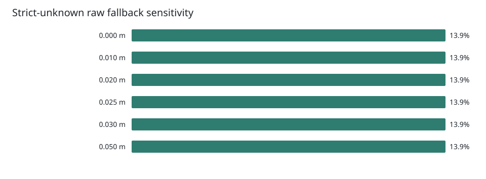

# Candidate Validator Stage 2 Shadow Validation

- Date: 2026-07-17
- Branch: `codex/m20-candidate-validator-stage2-shadow`
- Status: shadow implementation validated; authoritative activation blocked
- Legacy controller decision: unchanged

## Result

Stage 2 now evaluates the legacy and physical policies from the same raw path,
alpha candidates, distance transform, and sampled costmap metrics. The MuJoCo
profile enables physical shadow but leaves
`path_smoothing_physical_validator_authoritative_enabled: false`.

The qualified evidence set contains **316 successful plans**: 187 retained
Stage 1 static/dynamic plans plus 129 race-free Stage 2 live plans. Every
qualified live plan had exactly one shadow record, maximum odometry drift was
0.0001 m, and the valid-run logs contained no LocalPlanner or planner-thread
exception.

| Qualified set | Requests | Successful | Physical shadow | Max drift |
|---|---:|---:|---:|---:|
| Historical dynamic | 147 | 85 | replay only | 0.0000 m |
| Historical static | 147 | 102 | replay only | 0.0000 m |
| Race-fix smoke | 10 | 9 | yes | 0.0001 m |
| Office dynamic clean | 72 | 70 | yes | 0.0000 m |
| Narrow/turn clean performance | 50 | 50 | yes | 0.0000 m |

`no_path_or_timeout` and `raw_baseline_invalid` are not counted as validator
successes. Pre-race-fix runs remain available as diagnostic data but are listed
in `failures.json` and excluded from the qualified total.

## Physical Decisions

Across 129 qualified live physical-shadow plans:

| Physical result | Count |
|---|---:|
| alpha 1.0 | 67 |
| alpha 0.5 | 23 |
| alpha 0.25 | 2 |
| alpha 0.125 | 3 |
| raw fallback | 34 |
| Legacy/physical match | 83 (64.3%) |

The physical raw-fallback rate is **26.4%**, above the 20% investigation
threshold. The dominant cause is strict zero unknown-length increase, not the
0.025 m clearance threshold: qualified candidates recorded 227 unknown
rejections, 60 lethal rejections, and no selected-policy violation.

This fallback rate is not improved by weakening collision or unknown rules.
It means the current normal-navigation unknown contract and the mapper's
unknown boundary need a dedicated decision before physical selection can
become authoritative.

## Threshold Replay

The saved 187-plan Stage 1 dataset was replayed over six clearance thresholds
and three unknown tolerances. With unknown increase fixed at 0.0 m:

| Max clearance loss | alpha 1.0 | Other alpha | Raw | Raw ratio |
|---:|---:|---:|---:|---:|
| 0.000 m | 124 | 37 | 26 | 13.9% |
| 0.010 m | 139 | 22 | 26 | 13.9% |
| 0.020 m | 154 | 7 | 26 | 13.9% |
| 0.025 m | 154 | 7 | 26 | 13.9% |
| 0.030 m | 154 | 7 | 26 | 13.9% |
| 0.050 m | 157 | 4 | 26 | 13.9% |

The historical data cannot distinguish **0.020 m from 0.025 m**. The proposed
0.025 m remains a reasonable half-cell *shadow candidate*, but it is not a
validated production threshold because localization/tracking error is still
unmeasured and the critical corridor cases expose a separate raw-path issue.

## Narrow Passages

The generated scene uses a 0.9 m robot width, 1.1 planner inflation, and 0.05 m
cells, giving an effective 0.99 m planning width. Each critical goal was
repeated 15 times in the exploratory run and 10 more times after raw-invalid
instrumentation was added.

| Physical corridor | Expected | Observed |
|---:|---|---|
| 0.95 m | blocked | 15/15 raw baseline invalid |
| 1.00 m | critical/discretization-sensitive | 15/15 raw baseline invalid |
| 1.20 m | comfortable | 15/15 valid plans |
| Wide straight/turn/S/V area | valid | 60/60 valid plans |

The 0.95 m and 1.00 m cases reveal an upstream contract gap: grid A* can emit
a path whose continuous post-sampling intersects a lethal cell. Stage 2 now
logs these as `raw_baseline_invalid` rather than silently omitting a shadow
record. A physical authoritative mode cannot safely fall back to such a raw
path, so this issue blocks activation.

## Performance

The clean A/B uses the same generated scene, five goals, ten repetitions, C++
A*, and fixed odometry. Online map updates are deterministic in setup but are
not byte-identical snapshots, so exact-metrics policy replay is reported too.

| Metric | Shadow off | Shadow on | Change |
|---|---:|---:|---:|
| Planner P50 | 280.6 ms | 308.5 ms | +9.9% |
| Planner P95 | 360.3 ms | 389.4 ms | **+8.1%** |
| Planner max | 502.1 ms | 546.0 ms | +8.7% |
| Distance transform P95 | 2.22 ms | 2.15 ms | no regression |
| Candidate evaluation P95 | 12.54 ms | 14.19 ms | +13.1% |
| Validator total P95 | 99.42 ms | 106.72 ms | +7.3% |
| Average CPU | 3.72 cores | 3.69 cores | -0.6% |
| Peak sampled RSS | 4993 MB | 4972 MB | -21 MB |
| Log bytes/plan P50 | 3679 B | 3894 B | +5.9% |

On exact saved raw/candidate metrics, the physical policy itself costs P50
1.5 us and P95 2.33 us. The online P95 increase remains below the 20% target;
the main runtime cost is the already-required path metric sampling, not the
physical comparisons.

## Hard Acceptance

| Requirement | Result |
|---|---|
| At least 300 successful plans | Pass: 316 |
| Selected lethal/out-of-bounds candidates | Pass: 0 |
| Selected unknown-length violations | Pass: 0 |
| Selected clearance violations | Pass: 0 |
| Static repeated decision consistency | Pass: 5/5 goals, 100% |
| Successful plan/shadow match | Pass: 100% |
| Fixed odometry drift <= 0.01 m | Pass: 0.0001 m max |
| Runtime planner exceptions | Pass: 0 in qualified runs |
| Authoritative default false | Pass |
| P95 overhead <= 20% | Pass: +8.1% |
| Raw fallback <= 20% | **Investigated, not passed: 26.4%** |

## Decision

Do **not** enable authoritative physical selection yet. Keep the implementation
in shadow mode and keep 0.025 m explicitly provisional. The next phase remains
validator/raw-path contract work, not turn-aware A*:

1. Decide whether normal navigation forbids all unknown increase or allows a
   map-resolution-aware numerical tolerance backed by mapper uncertainty.
2. Prevent or reject `raw_baseline_invalid` A* output before LocalPlanner.
3. Measure real localization and tracking error before finalizing clearance.
4. Re-run the same clean matrix; only then consider an authoritative trial.

Turn-aware A* remains valuable for macro V-shapes, but it should not precede
these safety-contract fixes.

## Artifacts

- `aggregate-summary.json`, `scenario-summary.csv`: qualified aggregate.
- `threshold-replay.json`, `threshold-replay.csv`: 18 replay combinations.
- `decision-differences.csv`: legacy/physical comparison.
- `performance.json`: clean A/B and exact-metrics policy timing.
- `failures.json`, `runtime-audit.json`: excluded runs and runtime audit.
- `scenario-manifest.json`, `*-goals.json`, `narrow-scene-metadata.json`: inputs.
- Per-run directories contain JSON reports; local `.npz` path snapshots were
  intentionally excluded from Git to avoid unnecessary binary/LFS assets.
